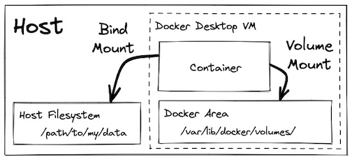

[Home](../README.md) |
[History & Motivation](../01-history-and-motivation/README.md) |
[Technology Overview](../02-technology-overview/README.md) |
[Docker Containers](../03-docker-containers/README.md) |
[Networking](../04-docker-networking/README.md) |
[Port Binding](../05-docker-port-binding/README.md) |
[Volumes](../06-docker-volumes/README.md) |
[Layers](../07-docker-layers/README.md) |
[Build](../08-docker-build-dockerfile/README.md) |
[Registry](../09-docker-registry/README.md) |
[Compose](../10-docker-compose/README.md)

# 06. Docker Volumes

This file teaches **how to manage persistent data in Docker**. If you can use everything here, you can safely store database data, handle application state, work with configuration files, and clean up volumes without losing important data.

1. [The Core Problem (Why Volumes Exist)](#1-the-core-problem-why-volumes-exist)
2. [Proof: Data Dies With Containers](#2-proof-data-dies-with-containers)
3. [Volume Types (Only Two)](#3-volume-types-only-two)
4. [Named Volumes (Step-by-Step)](#4-named-volumes-step-by-step)
5. [Bind Mounts (Step-by-Step)](#5-bind-mounts-step-by-step)
6. [Volume Management Commands](#6-volume-management-commands)
7. [When to Use What (Decision Table)](#7-when-to-use-what-decision-table)
8. [Real-World Database Example](#8-real-world-database-example)
9. [Safe Delete Flow (Volumes Edition)](#9-safe-delete-flow-volumes-edition)  
[Final Compression (Memorize)](#final-compression-memorize)

---

## 1. The Core Problem (Why Volumes Exist)

**Situation:**
- Containers are designed to be disposable
- Containers can stop, be deleted, and be recreated anytime
- Anything written **inside a container's filesystem** dies when the container is deleted

**Problem:**
- Databases need to save data
- Applications upload files
- Logs need to persist
- Configuration changes must survive

**Solution:**
Docker separates **compute** (containers) from **data** (volumes).

**Mental model:**
```
Container (temporary) ──> Volume (permanent)
     ↓ dies                    ↓ survives
```

---

## 2. Proof: Data Dies With Containers

### Experiment: Write data, delete container, check if data survives

| Step | What you do | Command | Expected result |
|---:|---|---|---|
| 1 | Create container and enter it | `docker run -it --name test-container ubuntu:22.04` | You're inside container |
| 2 | Create folder and write data | `mkdir /my-data`<br>`echo "hello" > /my-data/file.txt` | File created |
| 3 | Verify file exists | `cat /my-data/file.txt` | Prints: `hello` |
| 4 | Exit container | `exit` | Back to host terminal |
| 5 | Restart same container | `docker start -i test-container` | You're inside again |
| 6 | Check if file still exists | `cat /my-data/file.txt` | Prints: `hello` (still there) |
| 7 | Exit again | `exit` | Back to host |
| 8 | **Delete the container** | `docker rm test-container` | Container removed |
| 9 | Create new container (same image) | `docker run -it --name test-container ubuntu:22.04` | Fresh container |
| 10 | Try to read the file | `cat /my-data/file.txt` | **Error: file not found** |

**Conclusion:**
- Stopping a container → data survives
- Deleting a container → data is destroyed
- **This is why volumes exist**

---

## 3. Volume Types (Only Two)

### 1) Named Volumes (Recommended for most use cases)
- Managed by Docker
- Lives in Docker's storage area
- Independent of your host file system
- Best for: databases, production data, anything critical

### 2) Bind Mounts (Developer convenience)
- Direct link to a specific host directory
- You control the exact location
- Best for: source code, config files, local development

**Mental model:**
```
Named Volume:    Docker manages storage location
                 (You don't care where, Docker handles it)

Bind Mount:      You specify exact host path
                 (You control where files live on your laptop)
```



---

## 4. Named Volumes (Step-by-Step)

### Goal: Create persistent storage that survives container deletion

| Step | What you do | Command format | Example you run |
|---:|---|---|---|
| 11 | Create a named volume | `docker volume create VOLUME_NAME` | `docker volume create my-data` |
| 12 | List all volumes | `docker volume ls` | `docker volume ls` |
| 13 | Inspect volume details | `docker volume inspect VOLUME_NAME` | `docker volume inspect my-data` |
| 14 | Run container with volume attached | `docker run -it --rm -v VOLUME_NAME:/container/path IMAGE` | `docker run -it --rm -v my-data:/app/data ubuntu:22.04` |

### Workflow: Create volume, write data, verify persistence

| Step | What you do | Command | What happens |
|---:|---|---|---|
| 15 | Create volume | `docker volume create app-storage` | Volume created (empty) |
| 16 | Run container with volume | `docker run -it --rm -v app-storage:/data ubuntu:22.04` | Container started, `/data` mapped to volume |
| 17 | Write data inside container | `echo "persistent data" > /data/file.txt` | Data written to volume |
| 18 | Verify data | `cat /data/file.txt` | Prints: `persistent data` |
| 19 | Exit container | `exit` | Container deleted (because of `--rm`) |
| 20 | Run NEW container with SAME volume | `docker run -it --rm -v app-storage:/data ubuntu:22.04` | Fresh container, same volume |
| 21 | Check if data survived | `cat /data/file.txt` | **Prints: `persistent data`** ✅ |

**Key insight:**
- Container A writes to volume → container deleted
- Container B reads from same volume → **data is still there**

**Syntax breakdown:**
```bash
docker run -v VOLUME_NAME:/container/path IMAGE
           ↑              ↑
         volume name    where it appears inside container
```

---

## 5. Bind Mounts (Step-by-Step)

### Goal: Link a host folder directly into a container

| Step | What you do | Command format | Example you run |
|---:|---|---|---|
| 22 | Check your current location | `pwd` | `pwd` (note the output) |
| 23 | Create a folder on host | `mkdir host-data` | `mkdir host-data` |
| 24 | Run container with bind mount | `docker run -it --rm -v /absolute/host/path:/container/path IMAGE` | `docker run -it --rm -v $(pwd)/host-data:/data ubuntu:22.04` |

### Workflow: Bind mount, write data, verify on host

| Step | What you do | Command | What happens |
|---:|---|---|---|
| 25 | Create folder on host | `mkdir ~/my-app-data` | Folder created on your laptop |
| 26 | Run container with bind mount | `docker run -it --rm -v ~/my-app-data:/data ubuntu:22.04` | `/data` inside container = `~/my-app-data` on host |
| 27 | Write file inside container | `echo "from container" > /data/test.txt` | File written |
| 28 | Exit container | `exit` | Container deleted |
| 29 | Check file on host | `cat ~/my-app-data/test.txt` | **Prints: `from container`** ✅ |
| 30 | Edit file on host | `echo "from host" >> ~/my-app-data/test.txt` | Modified on laptop |
| 31 | Run new container with same mount | `docker run -it --rm -v ~/my-app-data:/data ubuntu:22.04` | Fresh container |
| 32 | Read file inside container | `cat /data/test.txt` | Sees both lines (changes from host appear immediately) |

**Key insight:**
- Changes in container → visible on host immediately
- Changes on host → visible in container immediately
- It's the **same folder**, just accessed from two places

**Syntax breakdown:**
```bash
docker run -v /host/path:/container/path IMAGE
           ↑            ↑
     real folder    where it appears
     on laptop      inside container
```

---

## 6. Volume Management Commands

| Step | What you do | Command format | Example you run |
|---:|---|---|---|
| 33 | List all volumes | `docker volume ls` | `docker volume ls` |
| 34 | Inspect a volume (see location, driver, etc.) | `docker volume inspect VOLUME_NAME` | `docker volume inspect app-storage` |
| 35 | Delete a specific volume | `docker volume rm VOLUME_NAME` | `docker volume rm app-storage` |
| 36 | Delete all unused volumes | `docker volume prune` | `docker volume prune` |
| 37 | Force delete all unused volumes (no confirmation) | `docker volume prune -f` | `docker volume prune -f` |

**Important rule:**
- You cannot delete a volume that is currently being used by a container
- Stop and remove the container first, then delete the volume

---

## 7. When to Use What (Decision Table)

| Situation | Use | Why |
|---|---|---|
| Database data (MySQL, MongoDB, PostgreSQL) | Named Volume | Data must survive container replacement |
| Application uploads (user files, images) | Named Volume | Critical data, managed by Docker |
| Production state, logs | Named Volume | Needs to persist across deployments |
| Source code during development | Bind Mount | You edit files on laptop, changes appear in container immediately |
| Configuration files | Bind Mount | Easy to edit, version control |
| Temporary testing | Bind Mount | Quick access to files |

**Decision rule:**
```
If data must survive and you don't need to touch it often → Named Volume
If you need to edit files frequently from host → Bind Mount
```

---

## 8. Real-World Database Example

### MongoDB with named volume

**Problem:**
- MongoDB stores data in `/data/db` inside the container
- If container is deleted, database is lost
- We need data to survive container deletion

**Solution:**
```bash
docker run -d \
  --name mongodb \
  -p 27017:27017 \
  -v mongodata:/data/db \
  -e MONGO_INITDB_ROOT_USERNAME=admin \
  -e MONGO_INITDB_ROOT_PASSWORD=secret \
  mongo:6
```

**What this does:**
- `-v mongodata:/data/db` → creates volume `mongodata` and mounts it to MongoDB's data directory
- MongoDB writes to `/data/db`
- Data actually goes to the `mongodata` volume
- If you delete the container and create a new one with the same volume, **all data is still there**

**Verification flow:**

| Step | Command | What happens |
|---:|---|---|
| 1 | Run MongoDB with volume | `docker run -d --name mongodb -v mongodata:/data/db mongo:6` | Container starts, volume created |
| 2 | Connect and create data | `docker exec -it mongodb mongosh` | Enter MongoDB shell |
| 3 | Insert test data | `use testdb`<br>`db.users.insertOne({name: "Alice"})` | Data written |
| 4 | Exit | `exit` | Back to host |
| 5 | Stop and delete container | `docker stop mongodb`<br>`docker rm mongodb` | Container gone |
| 6 | Start new container with same volume | `docker run -d --name mongodb -v mongodata:/data/db mongo:6` | Fresh container, same volume |
| 7 | Check if data survived | `docker exec -it mongodb mongosh`<br>`use testdb`<br>`db.users.find()` | **Data still exists** ✅ |

---

## 9. Safe Delete Flow (Volumes Edition)

**Rule:** Volumes are independent of containers. You can delete a container without deleting its volume.

### Order of operations (non-negotiable)

| Step | What you do | Command format | Example |
|---:|---|---|---|
| 38 | Stop container (if running) | `docker stop CONTAINER_NAME` | `docker stop mongodb` |
| 39 | Remove container | `docker rm CONTAINER_NAME` | `docker rm mongodb` |
| 40 | **Only if you want to delete data:** Remove volume | `docker volume rm VOLUME_NAME` | `docker volume rm mongodata` |

**Critical safety rule:**
- Removing a container does **NOT** delete its volumes
- Volumes persist until you explicitly delete them
- This prevents accidental data loss

**When to delete volumes:**
- Testing is done and you don't need the data
- Cleaning up old projects
- Resetting state completely

**When NOT to delete volumes:**
- Production data
- Any database you still need
- Anything you might want later

---

## Final Compression (Memorize)

**Problem:**
Containers are temporary → data inside them dies

**Solution:**
Volumes are permanent → data survives container deletion

**Two types:**
1. Named volumes → Docker manages, use for critical data
2. Bind mounts → You control path, use for development

**Commands to memorize:**
```bash
# Named volume
docker volume create my-vol
docker run -v my-vol:/data IMAGE

# Bind mount
docker run -v /host/path:/container/path IMAGE

# Management
docker volume ls
docker volume rm VOLUME_NAME
docker volume prune
```

**Mental model:**
```
Container (code runs here)  ──>  Volume (data lives here)
    ↓                              ↓
  Dies when deleted            Survives forever
```

**Delete order:**
1. Stop container
2. Remove container
3. (Optional) Remove volume

**Never forget:**
Data in containers = temporary  
Data in volumes = permanent