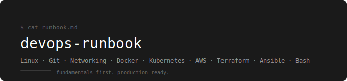

<p align="center">
  
</p>

<p align="center">
  <a href="./LICENSE"></a>
  <a href="https://paypal.me/AkhilTejaDoosari"></a>
</p>

A personal DevOps runbook — structured notes and labs built from fundamentals up, using one consistent application across every tool.

---

## Why This Exists

Most DevOps content teaches tools in isolation. Commands work but nothing connects.
This runbook takes the opposite approach — every tool is learned in context, every concept links back to its foundation, and the same application runs through every layer.

The goal is the kind of understanding that holds up under production pressure — not just knowing the command, but knowing what happens when you run it and why it was designed that way.

---

## The Webstore App

Every notes file and every lab uses the same 3-tier application as the running example. Nothing is abstract. The same app gets more complex as the tools advance — by the end it is running on AWS EKS with a full CI/CD pipeline, monitored with Prometheus and Grafana.

| Service | Image | Port | Role |
|---|---|---|---|
| webstore-frontend | nginx:1.24 | 80 | Serves the store UI |
| webstore-api | nginx:1.24 | 8080 | Handles products and orders |
| webstore-db | postgres:15 | 5432 | Stores products, orders, users |

This stack is locked. Every tool in this runbook operates on these three services.

---

## Where the Webstore Goes — Tool by Tool

This is the thread. Each tool picks up exactly where the previous one left off.

| Tool | What you do to the webstore | State of the app after |
|---|---|---|
| **Linux** | Create the project directory structure, write config files, set permissions, install nginx, manage it as a service, debug it over the network | Running on a Linux server, files organized, nginx serving the frontend, logs being written |
| **Git** | Initialize a repo, commit the project history, create feature branches, tag the first release, push to GitHub | Version controlled, full commit history, v1.0 tagged, live on GitHub |
| **Networking** | Trace every packet from browser to webstore-api — DNS resolution, IP routing, TCP handshake, port binding, response | You can explain and debug every network hop the app makes |
| **Docker** | Containerize all three services, connect them on a Docker network, persist the database, build a custom image, push to registry, run the full stack with one Compose command | Fully containerized, portable, reproducible on any machine |
| **Kubernetes** | Deploy on a local cluster, add self-healing, rolling updates, persistent storage for the database, config and secret management | Orchestrated, self-healing, running on Minikube with postgres on a PVC |
| **CI-CD** | Write a GitHub Actions pipeline that builds and pushes the webstore-api image on every commit. Connect ArgoCD so every merge to main deploys automatically to the cluster | Code changes deploy themselves — no manual `kubectl apply` ever again |
| **Observability** | Install Prometheus, Grafana, and Loki on the cluster. Scrape every pod. Build dashboards. Set alerts. Query logs when something breaks | You can answer "what is wrong and where" before anyone finishes writing the incident ticket |
| **AWS** | Provision cloud infrastructure — EKS for the cluster, RDS PostgreSQL for the database, ALB for the load balancer, S3 for assets, CloudWatch for monitoring | Running in production on AWS |
| **Terraform** | Define all AWS infrastructure as code — VPC, subnets, EKS cluster, RDS, IAM roles | Infrastructure is version controlled, reproducible, destroyable and rebuildable in minutes |
| **Ansible** | Write playbooks that configure EC2 servers — install packages, manage services, push config files, enforce state across all nodes without touching them manually | Server configuration is automated, consistent, and repeatable across every environment |
| **Bash** | Write scripts that automate deployments, health checks, log rotation, and backup — the glue that holds the pipeline together | Operational automation in place, manual toil eliminated |

---

## Why These Tools

Every tool in this runbook was chosen deliberately. These are the reasons.

| Tool | Why this one | Why not the alternative |
|---|---|---|
| **Linux (Ubuntu)** | Industry standard for servers. AWS EC2 default. All DevOps tooling assumes it. | Windows Server — not used for containerized workloads. CentOS — dying in enterprise. |
| **Git + GitHub** | Git is non-negotiable for version control. GitHub is where the jobs, PRs, Actions, and open source ecosystem live. | GitLab and Bitbucket use the same Git — different UI, smaller ecosystem for CI/CD integrations. |
| **Docker** | The container standard. Every Kubernetes node runs containers. Every CI pipeline builds images. | Podman — rootless but niche. containerd — runtime only, no build tooling for learning. |
| **Kubernetes** | The orchestration standard. AWS EKS, Google GKE, Azure AKS are all managed Kubernetes. Interviewers expect it. | Docker Swarm — dead in enterprise. Nomad — niche, used mainly at HashiCorp shops. |
| **GitHub Actions** | Built into the repo. No separate CI server to maintain. The standard for teams already on GitHub. | Jenkins — requires a dedicated server and ongoing maintenance. CircleCI — separate billing, separate ecosystem. |
| **ArgoCD** | The GitOps standard. Pull-based — the cluster pulls desired state from Git, nothing pushes into it. Declarative, auditable, rollback is a git revert. | Flux — same GitOps model, smaller community. Spinnaker — enterprise-scale overkill for this stack. |
| **Prometheus + Grafana + Loki** | The cloud-native observability stack. Ships as a single Helm chart. Every managed Kubernetes offering integrates with it. Grafana reads all three data sources in one UI. | Datadog — excellent but expensive. ELK stack — powerful for logs but heavy to run, separate from Prometheus. |
| **AWS** | Largest cloud market share (~32%). Most job postings reference AWS. EKS, RDS, and EC2 are interview staples. | GCP — strong in data and ML, smaller DevOps job market. Azure — dominant in Microsoft enterprise shops, not where most DevOps roles are. |
| **Terraform** | IaC standard. Cloud-agnostic. Declarative. Used in the majority of DevOps job descriptions. Massive community and module ecosystem. | Pulumi — code-based IaC, growing but niche. CloudFormation — AWS-only and verbose. |
| **Ansible** | Agentless — no software needed on target servers. YAML-based playbooks — same syntax as Kubernetes manifests. Dominant in DevOps job postings for configuration management. | Chef and Puppet — require agents on every server, fading in enterprise. SaltStack — niche. |
| **Bash** | Pre-installed on every Linux server and CI runner. The glue language of DevOps. What you reach for on a server at 2am when nothing else is available. | Python — better for complex scripting, but Bash is the first tool on every machine. Both matter, Bash comes first. |

---

## Learning Order

```
Linux → Git → Networking → Docker → Kubernetes → CI-CD → Observability → AWS → Terraform → Ansible → Bash
```

Networking before Docker — so Docker bridge, DNS, and NAT are not magic.
Networking before AWS — so VPC, Security Groups, and NAT Gateway are not magic.
Docker before Kubernetes — so Pods, Services, and image pulling are not magic.
Kubernetes before CI-CD — so you have a cluster to deploy to before you write the pipeline.
CI-CD before Observability — so you have a pipeline to observe before you instrument it.
Terraform before Ansible — Terraform provisions the infrastructure, Ansible configures what runs on it.

---

## Structure

| # | Tool | Notes | Labs |
|---|---|---|---|
| 01 | [Linux – System Fundamentals](./notes/01.%20Linux%20–%20System%20Fundamentals/README.md) | ✅ Complete | ✅ Complete |
| 02 | [Git & GitHub – Version Control](./notes/02.%20Git%20%26%20GitHub%20–%20Version%20Control/README.md) | ✅ Complete | ✅ Complete |
| 03 | [Networking – Foundations](./notes/03.%20Networking%20–%20Foundations/README.md) | ✅ Complete | ✅ Complete |
| 04 | [Docker – Containerization](./notes/04.%20Docker%20–%20Containerization/README.md) | ✅ Complete | ✅ Complete |
| 05 | [Kubernetes – Orchestration](./notes/05.%20Kubernetes%20–%20Orchestration/README.md) | 🔄 In progress | 🔄 In progress |
| 06 | [CI-CD – Pipelines & GitOps](./notes/06.%20CI-CD%20–%20Pipelines%20%26%20GitOps/README.md) | 🚧 Planned | 🚧 Planned |
| 07 | [Observability – Monitoring & Logs](./notes/07.%20Observability%20–%20Monitoring%20%26%20Logs/README.md) | 🚧 Planned | 🚧 Planned |
| 08 | [AWS – Cloud Infrastructure](./notes/08.%20AWS%20–%20Cloud%20Infrastructure/README.md) | 🔄 In progress | 🚧 Planned |
| 09 | [Terraform – IaC Foundations](./notes/09.%20Terraform%20–%20IaC%20Foundations/README.md) | 🔄 In progress | 🚧 Planned |
| 10 | [Ansible – Configuration Management](./notes/10.%20Ansible%20–%20Configuration%20Management/README.md) | 🚧 Planned | 🚧 Planned |
| 11 | [Bash – Shell Scripting Essentials](./notes/11.%20Bash%20–%20Shell%20Scripting%20Essentials/README.md) | 🚧 Planned | 🚧 Planned |

---

## How to Use This Runbook

**1. Go in order.**
The learning order is not random. Each tool builds directly on the previous one. Skipping Networking before Docker means Docker networking will feel like magic — and magic breaks in production without warning.

**2. Read the notes before opening a terminal.**
Every notes file starts with the mental model. Read it fully before touching a command. Understanding why something works is what lets you debug it when it breaks.

**3. Do the labs from scratch.**
Every lab says "write from scratch." This means it. Do not copy-paste commands. Typing them yourself forces your brain to process each flag and each decision. Speed comes later — understanding comes first.

**4. Break things on purpose.**
Every lab has a "Break It on Purpose" section. Do not skip it. These are the failure states you will actually hit in production. Reading about them is not the same as producing the error yourself and reading the output.

**5. Do not move on until the checklist is done.**
Every lab ends with a checklist. Every box must be checked before moving to the next lab. If you cannot check a box honestly, go back and do it properly.

**6. When stuck — read the error first.**
Before searching anything, read the full error message. Most errors tell you exactly what is wrong. The habit of reading errors carefully is more valuable than any specific command.

**7. Use the Networking folder as a reference.**
The networking notes are the foundation for Docker, Kubernetes, and AWS. Any time something feels abstract in those tools, go back to the Networking folder — the concept is explained there without tool-specific noise.

---

## Sources

Notes in this repository are synthesized from multiple resources — YouTube channels, Udemy courses, private courses, and official documentation. No single source is followed exclusively. Where one explanation fell short, a better one was found elsewhere and the best version was kept.

Credits to the DevOps and cloud community at large.

---

## License

This repository is licensed under the [MIT License](./LICENSE).
You are free to use, adapt, and share the content — just keep the copyright notice.

---

## Support

If this runbook saved you time or helped something click, you can support it here.

[](https://paypal.me/AkhilTejaDoosari)

---

## Contact

- Email: doosariakhilteja@gmail.com
- LinkedIn: https://linkedin.com/in/akhiltejadoosari2001
- GitHub: https://github.com/AkhilTejaDoosari
