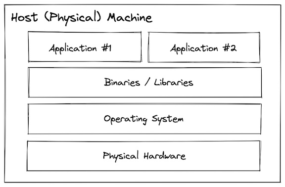
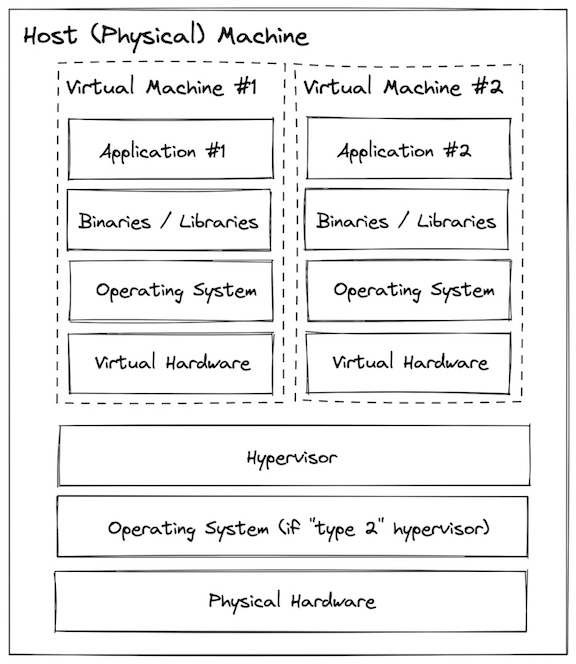
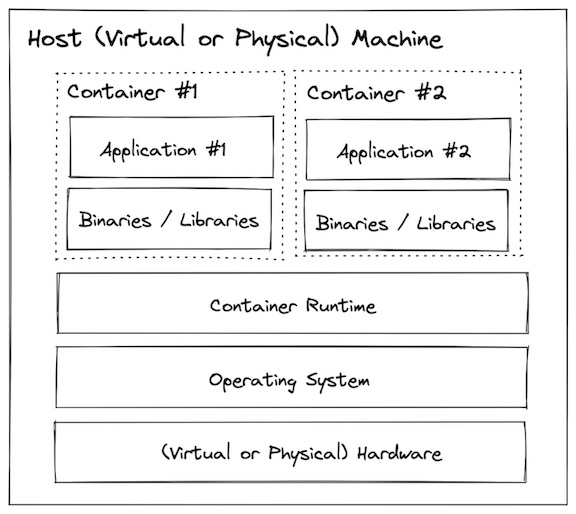
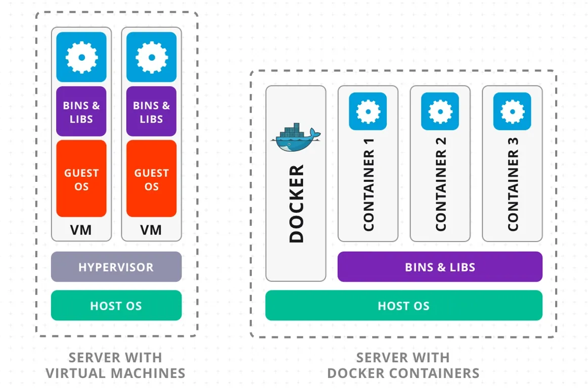
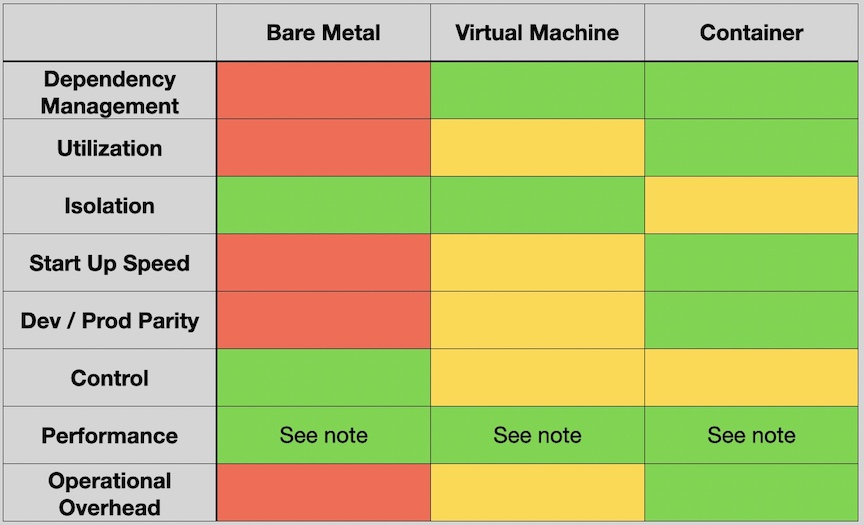

[Home](../README.md) |
[History & Motivation](../01-history-and-motivation/README.md) |
[Technology Overview](../02-technology-overview/README.md) |
[Docker Containers](../03-docker-containers/README.md) |
[Port Binding](../04-docker-port-binding/README.md) |
[Networking](../05-docker-networking/README.md) |
[Volumes](../06-docker-volumes/README.md) |
[Layers](../07-docker-layers/README.md) |
[Build](../08-docker-build-dockerfile/README.md) |
[Registry](../09-docker-registry/README.md) |
[Compose](../10-docker-compose/README.md)

---

# History and Motivation

<!-- no toc -->
  - [Why Docker Exists](#why-docker-exists)
  - [What is a container?](#what-is-a-container)
  - [History of virtualization](#history-of-virtualization)
    - [Bare Metal](#bare-metal)
    - [Virtual Machines](#virtual-machines)
    - [Containers](#containers)
    - [Tradeoffs](#tradeoffs)
  - [What Containerizing the Webstore Gives You](#what-containerizing-the-webstore-gives-you)

---

## Why Docker Exists

Before Docker, an app worked on your laptop because your machine already had the right setup. The same app often failed on testing or production machines, not because the code was wrong, but because the environment was different. Different OS packages, different runtime versions, or missing dependencies caused the break.

Docker solves this environment problem.

Instead of moving only the code, Docker packages the app together with everything it needs to run. That package behaves the same way on any machine that supports Docker. The goal is not speed or magic. The goal is consistency.

Docker has two core parts.
- A Docker **image** is a fixed definition of the environment. It describes what should exist, but it does not run.
- A Docker **container** is a running copy of that image. Containers are created from images, run the app, and can be stopped and deleted anytime.

Because containers are meant to be replaced, rebuilding them is normal. One image can create many identical containers. This makes it easy to run different apps or different versions on the same machine without conflicts.

One important rule stays constant: containers run the application, but they should not store important data. Anything that must survive restarts or deletions should live outside the container.

Everything else in Docker exists to support this idea.

## What is a container?

A Docker container image is a lightweight, standalone, executable package of software that includes everything needed to run an application (https://www.docker.com/resources/what-container/).

## History of virtualization

### Bare Metal

**What this means?**
In a bare metal setup, applications run directly on the same operating system without strong separation. All applications share the same OS, system libraries, CPU, and memory. Because there are no clear boundaries, one application can directly affect others.

**Why this is a problem?**
If one app installs or upgrades a library, it may break another app. If one app consumes too much CPU or memory, it can slow down the entire system. If one app crashes, the impact can spread beyond just that app. Over time, this makes systems fragile and hard to manage.

**Simple analogy!**
Imagine multiple people cooking in the same kitchen with **one stove and one pantry**. Everyone uses the same ingredients and tools. If one person uses all the ingredients or burns the stove, everyone else is affected. There is no separation, so one person's mistake becomes everyone's problem.



**Why the industry moved on:**
- Apps break each other
Different apps need different versions of the same software, so installing or updating one app can break another.

- Machine resources are wasted
CPU and memory are not used well; one app may use too much while others sit idle.

- One problem affects everything
If one app crashes or misbehaves, it can impact the whole system.

- Starting and stopping is slow
Services take minutes to start or stop.

- Creating and removing systems is very slow
Setting up or removing a machine takes hours or even days.

---

### Virtual Machines

**What this means?**
In a virtual machine setup, applications do not run directly on the host OS.
Instead, a hypervisor creates multiple virtual computers on one physical machine.
Each virtual machine has its own operating system, libraries, CPU share, and memory.
Because each VM is separated, one VM cannot directly mess with another.

**Why this is better than bare metal?**
Since every VM has its own OS and environment:
- Apps don't fight over libraries
- Crashes usually stay inside one VM
- Resources are more controlled

This makes systems more stable and predictable than bare metal.

**Simple analogy!**
Imagine an apartment building.
- Each family lives in their own apartment
- Everyone has their own kitchen and bathroom
- If one family burns food, it doesn't destroy the whole building

There is separation, but the building itself is still shared.



**What problems still exist?**

Even though VMs fix many bare-metal issues, they introduce new ones:

- Each VM runs a full operating system
- OS takes memory, CPU, and disk even if the app is small
- Starting a VM takes minutes, not seconds
- Creating or deleting VMs is still slow
- Running many VMs becomes expensive and heavy

**Why the industry moved forward again**

- Too much overhead per app (full OS every time)
- Slower startup compared to containers
- Lower density (fewer apps per machine)
- Not ideal for fast development and scaling

**Virtual machines solved isolation and stability, but they are still heavy, slow, and resource-hungry.**
That gap is exactly where containers come in next.

---

### Containers

**What this means?**
In a container setup, applications do not get their own operating system. There is one operating system on the machine, and all containers use that same OS core (kernel).
Each application runs inside its own container, which gives it:
- its own files
- its own settings
- its own view of the system
So even though apps share the same OS underneath, they cannot see or touch each other.
This separation is created using built-in Linux features, not fake hardware and not extra operating systems.

**Why this is an improvement?**
Compared to virtual machines:
- No extra OS to install
- No OS to boot for every app
- Much less memory and CPU usage
- Apps start almost instantly
You can run many containers on one machine without wasting resources.

**Simple analogy!**
Imagine an apartment building. One building, One plumbing system, One power connection

Each apartment:
- has its own door
- its own rooms
- its own locks

People inside one apartment cannot see or affect people in another apartment.
The building = host operating system
The apartments = containers
Everyone shares the same building, but lives separately.



**Why the industry moved here**

- Apps no longer break each other
- Resources are used more efficiently
- Starting and stopping apps takes seconds
- Easy to create, delete, and move apps
- Perfect for development and modern cloud systems

### VM vs Docker (Mental Model Snapshot)



## VM vs Docker — Resource & Kernel Model

**Virtual Machines:**
- Hardware virtualization
- Guest OS per VM
- Reserved CPU/RAM
- Strong isolation
- Slower, heavier

**Docker Containers:**
- OS-level virtualization
- Shared host kernel
- No reserved CPU/GPU
- Process-level isolation
- Fast, lightweight

**Core Difference:**
VMs virtualize hardware.
Containers isolate processes.

---

### Tradeoffs



***Note:*** There is much more nuance to "performance" than this chart can capture. A VM or container doesn't inherently sacrifice much performance relative to the bare metal it runs on, but being able to have more control over things like connected storage, physical proximity of the system relative to others it communicates with, specific hardware accelerators, etc… do enable performance tuning

---

## What Containerizing the Webstore Gives You

The webstore on a Linux server — nginx on port 80, the API on port 8080, postgres on port 5432 — works on your machine because your machine is set up correctly. The right postgres version is installed. The right nginx config is in place. The right environment variables are set.

Now you want to deploy it. The production server is a fresh Ubuntu instance. It does not have postgres. It does not have the right nginx config. You SSH in, install dependencies manually, adjust configs, and hope you did not miss anything. This is the environment problem Docker solves.

**What changes when you containerize the webstore:**

The webstore-api image contains the application code, the runtime, and every dependency it needs — packaged together. When you run that image on the production server, the same container starts. Same runtime version. Same dependencies. No manual installation. No configuration drift between environments.

```
Without Docker:
  Your laptop → "works on my machine"
  Staging server → "missing postgres version mismatch"
  Production server → "env var missing, nginx config wrong"

With Docker:
  Your laptop → docker compose up → webstore running
  Staging server → docker compose up → same webstore
  Production server → docker compose up → same webstore
```

**What each container gets:**
- `webstore-frontend` — nginx:1.24 serving static files, same image in dev and prod
- `webstore-api` — built from your Dockerfile, same image that passed CI
- `webstore-db` — postgres:15, same version everywhere, data in a volume that survives container replacement

**What you hand to Kubernetes after Docker:**
A Kubernetes cluster does not know what your app is. It pulls container images from a registry and runs them. Everything you build in Docker — images, tags, environment variables, port mappings — is exactly what Kubernetes reads. Docker is not a stepping stone to Kubernetes. It is the prerequisite.
