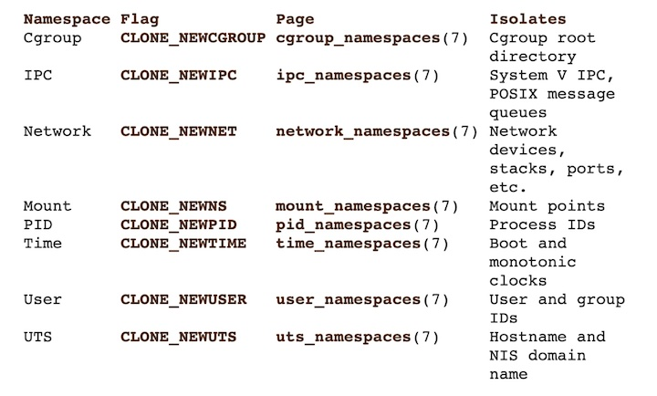
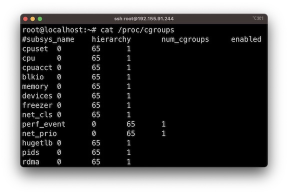
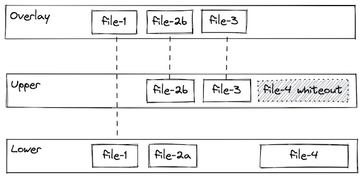
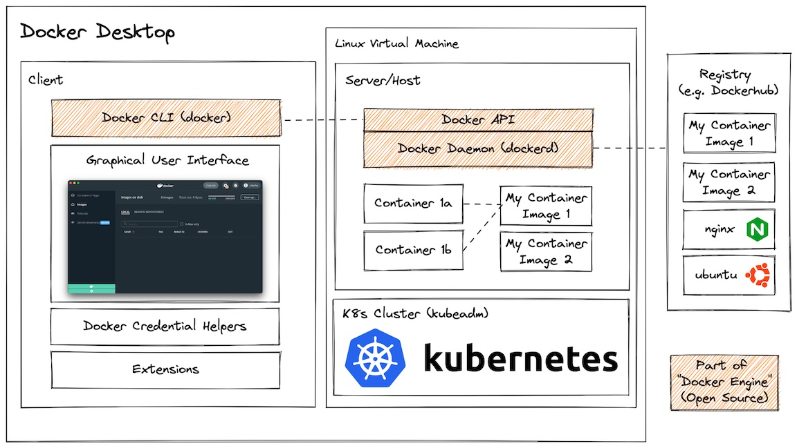

[Home](../README.md) |
[History & Motivation](../01-history-and-motivation/README.md) |
[Technology Overview](../02-technology-overview/README.md) |
[Docker Containers](../03-docker-containers/README.md) |
[Port Binding](../04-docker-port-binding/README.md) |
[Networking](../05-docker-networking/README.md) |
[Volumes](../06-docker-volumes/README.md) |
[Layers](../07-docker-layers/README.md) |
[Build](../08-docker-build-dockerfile/README.md) |
[Registry](../09-docker-registry/README.md) |
[Compose](../10-docker-compose/README.md)

---

# Technology Overview

<!-- no toc -->
- [Linux Building Blocks](#linux-building-blocks)
  - [Cgroups](#cgroups)
  - [Namespaces](#namespaces)
  - [Union filesystems](#union-filesystems)
- [Docker Application Architecture](#docker-application-architecture)

## Linux Building Blocks

### Process → Namespace → cgroups (Clean Flow)

A **process** is a running program.
Every application starts as a process on the system.
By default, a process can see the entire system and use as many resources as it wants.

Linux then introduced **namespaces**.
A namespace limits what a process can see.
The process is intentionally made blind to the rest of the system.
It sees only its own processes, network, files, users, and hostname.
This creates isolation.

Isolation alone is not enough.
A process could still consume all CPU or memory.

So Linux added **cgroups**.
cgroups limit how much CPU, memory, and other resources a process can use.
These limits are enforced by the kernel.

When a process is started with namespaces and cgroups applied, it becomes what we call a container.

**One-line lock:**
A container is just a process with restricted view and restricted usge.

---

### Namespaces 
This table shows the Linux resources that can be isolated using namespaces. This is for reference only.
 

---

### Cgroups
Cgroups are a Linux kernel feature which allow processes to be organized into hierarchical groups whose usage of various types of resources can then be limited and monitored. 

With cgroups, a container runtime is able to specify that a container should be able to use (for example):
* Use up to XX% of CPU cycles (cpu.shares)
* Use up to YY MB Memory (memory.limit_in_bytes)
* Throttle reads to ZZ MB/s (blkio.throttle.read_bps_device)

 

---

### Union filesystems

Applications need many files. Copying the same files for every app wastes disk space.  

A union filesystem lets Linux stack multiple directories and present them as one directory.  
The directories are not actually merged. Linux only shows a combined view.  

In Docker, an image is made of read-only directories (layers). Linux stacks these layers and presents them as a single filesystem.  

When a container runs, Docker adds one writable directory on top. All read-only layers are shared and reused, not copied.  

This design avoids duplication, saves disk space, and keeps images lightweight.

**One-line lock:**
Union filesystem exists to reuse shared read-only files instead of copying them.

 

---

## Docker Application Architecture

Docker is not a single thing. It is made of a core engine, optional developer tooling, and image storage.

The core of Docker is Docker Engine. Docker Engine consists of the Docker daemon (dockerd) and the Docker CLI. The daemon does the real work: building images and running containers. The CLI is just the command you type to talk to the daemon using the Docker API. Docker Engine runs only on Linux and is what is used on servers and production systems.

Docker Desktop is a developer convenience, not Docker itself. It bundles the Docker CLI with a graphical interface, credential helpers, extensions, and a Linux virtual machine. This Linux VM runs Docker Engine inside it. Docker Desktop exists because macOS and Windows do not have the Linux kernel features Docker needs. When you use Docker Desktop, you are actually using Docker Engine running inside a Linux VM.

Container registries are not part of Docker, but they are required to store and share images. Docker can push images to registries and pull images from them. Docker Hub is the default registry, but many others exist. Registries only store images; they do not run containers.

**One-line lock:**
Docker Engine runs containers, Docker Desktop helps developers, and registries store images.

 

- You start on your machine and type a Docker command       →    That command goes to the Docker CLI.
- The Docker CLI does not do any real work                  →    It only sends your request to the Docker API.
- The Docker API is handled by the Docker daemon (dockerd)  →    This daemon is where everything actually happens.

The daemon runs inside Linux: 
- directly on a Linux server  
- inside a Linux virtual machine when using Docker Desktop on Mac or Windows  
This Linux environment is **Docker Engine.**

Docker Engine builds images and runs containers. Containers run here as Linux processes using namespaces, cgroups, and union filesystem.  
If an image is not available locally, Docker Engine pulls it from a registry. Registries only store images. They never run containers.  
Docker Desktop is just a wrapper. It provides a GUI, helpers, and a Linux VM so Docker Engine can run on non-Linux systems.  

**One-line lock:**
Command goes in → Docker Engine runs containers → registry stores images.