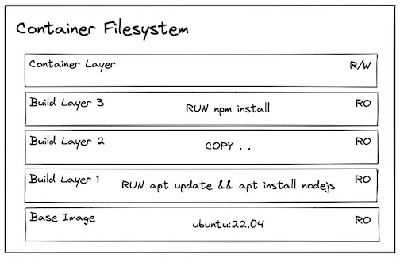

[Home](../README.md) |
[History & Motivation](../01-history-and-motivation/README.md) |
[Technology Overview](../02-technology-overview/README.md) |
[Docker Containers](../03-docker-containers/README.md) |
[Port Binding](../04-docker-port-binding/README.md) |
[Networking](../05-docker-networking/README.md) |
[Volumes](../06-docker-volumes/README.md) |
[Layers](../07-docker-layers/README.md) |
[Build](../08-docker-build-dockerfile/README.md) |
[Registry](../09-docker-registry/README.md) |
[Compose](../10-docker-compose/README.md)

# Docker Layers

## What this file is about

This file teaches **how Docker images are structured and optimized**. If you can use everything here, you can build faster images, understand caching behavior, optimize Dockerfiles for speed, and diagnose why builds are slow.

1. [What Are Layers (Visual First)](#1-what-are-layers-visual-first)
2. [See Layers With Your Own Eyes](#2-see-layers-with-your-own-eyes)
3. [How Layers Are Created (Dockerfile → Layers)](#3-how-layers-are-created-dockerfile--layers)
4. [Layer Caching in Action (Build Twice)](#4-layer-caching-in-action-build-twice)
5. [What Breaks the Cache](#5-what-breaks-the-cache)
6. [Optimization Pattern (Bad → Good Dockerfile)](#6-optimization-pattern-bad--good-dockerfile)
7. [Layer Reuse When Pulling Images](#7-layer-reuse-when-pulling-images)
8. [Verify Layer Sharing (Practical Check)](#8-verify-layer-sharing-practical-check)
9. [Common Mistakes That Waste Cache](#9-common-mistakes-that-waste-cache)
10. [The Container Runtime Layer](#10-the-container-runtime-layer)  
[Final Compression (Memorize)](#final-compression-memorize)

---

## 1. What Are Layers (Visual First)

**Core concept:**
A Docker image is NOT a single file.
It is a **stack of read-only layers**.

Each layer represents the filesystem changes from **one Dockerfile instruction**.



**What this image shows:**

```
┌─────────────────────────────────────────┐
│ WRITABLE CONTAINER LAYER (Runtime only) │  ← Created when container runs
│ Temporary, deleted with container       │
├─────────────────────────────────────────┤
│ LAYER 7: CMD ["node","app.js"]          │  ← Metadata only (no files)
├─────────────────────────────────────────┤
│ LAYER 6: COPY . .                       │  ← Your application code
├─────────────────────────────────────────┤
│ LAYER 5: RUN npm install                │  ← node_modules/ (heavy)
├─────────────────────────────────────────┤
│ LAYER 4: COPY package.json .            │  ← Dependency manifest
├─────────────────────────────────────────┤
│ LAYER 3: WORKDIR /app                   │  ← Directory structure
├─────────────────────────────────────────┤
│ LAYER 2: Intermediate OS setup          │  ← Base image internals
├─────────────────────────────────────────┤
│ LAYER 1: FROM node:20                   │  ← Base filesystem
└─────────────────────────────────────────┘
   ↑
   All these layers are READ-ONLY
   Stacked on top of each other
```

**Mental model:**
- Image = stack of transparent sheets
- Each sheet = one Dockerfile instruction
- Docker combines them into one visible filesystem
- Bottom layer = base image
- Top layer = your latest changes

---

## 2. See Layers With Your Own Eyes

**Goal:** Inspect actual layers of a real image.

| Step | What you do | Command | What to observe |
|---:|---|---|---|
| 1 | Pull a small image | `docker pull alpine:3.18` | Image downloaded |
| 2 | View its layers | `docker history alpine:3.18` | See each layer's size and command |
| 3 | Pull a Node.js image | `docker pull node:20-alpine` | Larger image downloaded |
| 4 | View its layers | `docker history node:20-alpine` | Many more layers visible |

**Example output:**
```bash
docker history node:20-alpine
```

```
IMAGE          CREATED        CREATED BY                                      SIZE
a1b2c3d4e5f6   2 weeks ago    CMD ["node"]                                    0B
b2c3d4e5f6a7   2 weeks ago    ENTRYPOINT ["docker-entrypoint.sh"]            0B
c3d4e5f6a7b8   2 weeks ago    COPY docker-entrypoint.sh /usr/local/bin/      1.2kB
d4e5f6a7b8c9   2 weeks ago    RUN /bin/sh -c apk add --no-cache ...          75MB
e5f6a7b8c9d0   2 weeks ago    ENV NODE_VERSION=20.11.0                        0B
f6a7b8c9d0e1   3 weeks ago    /bin/sh -c #(nop) ADD file:abc123... in /      7.3MB
```

**What each column means:**
- `IMAGE` → Layer ID (hash)
- `CREATED` → When this layer was built
- `CREATED BY` → Which Dockerfile instruction created it
- `SIZE` → How much disk space this layer added

**Key observations:**
1. Metadata instructions (`CMD`, `ENV`) add **0B** (no files changed)
2. `RUN` and `COPY` add actual size
3. Layers stack bottom → top
4. Each layer has a unique hash (ID)

---

## 3. How Layers Are Created (Dockerfile → Layers)

**Rule:** Each Dockerfile instruction creates one layer.

### Example Dockerfile:
```dockerfile
FROM node:20-alpine          # Layer 1
WORKDIR /app                 # Layer 2
COPY package.json .          # Layer 3
RUN npm install              # Layer 4
COPY . .                     # Layer 5
CMD ["node", "server.js"]    # Layer 6 (metadata)
```

### What happens during build:

| Step | Instruction | What Docker does | Layer created? |
|---:|---|---|---|
| 1 | `FROM node:20-alpine` | Downloads base image layers | Reuses existing layers |
| 2 | `WORKDIR /app` | Creates `/app` directory | ✅ New layer |
| 3 | `COPY package.json .` | Copies one file | ✅ New layer |
| 4 | `RUN npm install` | Installs dependencies | ✅ New layer (heavy) |
| 5 | `COPY . .` | Copies all source code | ✅ New layer |
| 6 | `CMD ["node", "server.js"]` | Sets metadata | ✅ New layer (0B) |

**Result:** 6 instructions = 6 new layers (plus base image layers)

**Mental model:**
```
Dockerfile line  →  Build step  →  New layer  →  Stacked on previous
```

---

## 4. Layer Caching in Action (Build Twice)

**Goal:** See Docker reuse layers when nothing changed.

### Experiment: Build the same image twice

| Step | What you do | Command | What happens |
|---:|---|---|---|
| 5 | Create a simple Dockerfile | See below | File created |
| 6 | Build image (first time) | `docker build -t cache-test:v1 .` | All layers built from scratch |
| 7 | Build image (second time) | `docker build -t cache-test:v1 .` | All layers use cache (instant) |

**Create this Dockerfile:**
```dockerfile
FROM alpine:3.18
RUN apk add --no-cache curl
RUN echo "Layer 3"
RUN echo "Layer 4"
CMD ["sh"]
```

**First build output:**
```bash
docker build -t cache-test:v1 .
```

```
[1/4] FROM alpine:3.18                                    5.2s
[2/4] RUN apk add --no-cache curl                         3.1s
[3/4] RUN echo "Layer 3"                                  0.3s
[4/4] RUN echo "Layer 4"                                  0.2s
```
**Total time: ~9 seconds**

**Second build output:**
```bash
docker build -t cache-test:v1 .
```

```
[1/4] FROM alpine:3.18                                    CACHED
[2/4] RUN apk add --no-cache curl                         CACHED
[3/4] RUN echo "Layer 3"                                  CACHED
[4/4] RUN echo "Layer 4"                                  CACHED
```
**Total time: ~0.1 seconds**

**What happened:**
- Docker computed a hash for each instruction
- Hashes matched previous build
- Docker reused existing layers
- No work needed = instant build

**Mental model:**
```
Same instruction + same context = same hash = reuse layer
```

---

## 5. What Breaks the Cache

**Rule:** Changing a layer invalidates that layer AND all layers after it.

### Experiment: Modify one line, see what rebuilds

| Step | What you do | Command | What happens |
|---:|---|---|---|
| 8 | Modify Layer 3 in Dockerfile | Change `echo "Layer 3"` to `echo "Modified"` | File changed |
| 9 | Rebuild | `docker build -t cache-test:v2 .` | Watch which layers rebuild |

**Modified Dockerfile:**
```dockerfile
FROM alpine:3.18
RUN apk add --no-cache curl
RUN echo "Modified"          # ← Changed this line
RUN echo "Layer 4"
CMD ["sh"]
```

**Build output:**
```
[1/4] FROM alpine:3.18                                    CACHED
[2/4] RUN apk add --no-cache curl                         CACHED
[3/4] RUN echo "Modified"                                 0.3s  ← Rebuilt
[4/4] RUN echo "Layer 4"                                  0.2s  ← Rebuilt
```

**What happened:**
- Layer 1 (FROM) → cached ✅
- Layer 2 (curl install) → cached ✅
- Layer 3 (echo modified) → **rebuilt** ❌
- Layer 4 (echo layer 4) → **rebuilt** ❌ (even though it didn't change!)

**Critical rule:**
```
Change at step N → rebuild N and everything after
```

**Why Layer 4 rebuilt:**
- Each layer depends on the previous layer's filesystem state
- Layer 3 changed
- Layer 4's context is now different (even if its instruction is the same)
- Docker cannot reuse it

---

## 6. Optimization Pattern (Bad → Good Dockerfile)

**Goal:** Order instructions to maximize cache reuse.

### Bad Dockerfile (cache breaks on every code change):

```dockerfile
FROM node:20-alpine
WORKDIR /app
COPY . .                     # ← Copies EVERYTHING (including package.json)
RUN npm install              # ← Reinstalls dependencies every time code changes
CMD ["node", "server.js"]
```

**Problem:**
- Any code change → `COPY . .` layer changes
- This breaks cache for `RUN npm install`
- Dependencies reinstall **every time** (even if package.json didn't change)

### Good Dockerfile (cache preserved for dependencies):

```dockerfile
FROM node:20-alpine
WORKDIR /app
COPY package.json .          # ← Copy ONLY dependency manifest first
RUN npm install              # ← Install dependencies (cached until package.json changes)
COPY . .                     # ← Copy source code last
CMD ["node", "server.js"]
```

**Why this is better:**
- Code changes don't affect `COPY package.json .`
- `RUN npm install` stays cached
- Only `COPY . .` rebuilds (fast)

### Side-by-side comparison:

| Scenario | Bad Dockerfile | Good Dockerfile |
|---|---|---|
| Change `server.js` | Reinstalls all dependencies (slow) | Copies new code only (fast) |
| Change `package.json` | Reinstalls dependencies | Reinstalls dependencies |
| No changes | Cached | Cached |

**Benchmark:**
```bash
# Bad pattern: Change one line of code
docker build -t app:bad .
# Time: 45 seconds (npm install runs again)

# Good pattern: Change one line of code
docker build -t app:good .
# Time: 2 seconds (only COPY . . runs)
```

**The optimization principle:**
```
Stable instructions first → Volatile instructions last
```

**Order of stability:**
1. Base image (`FROM`) - almost never changes
2. System packages (`RUN apt-get install`) - rarely changes
3. Dependencies (`COPY package.json` + `RUN npm install`) - changes occasionally
4. Source code (`COPY . .`) - changes frequently

---

## 7. Layer Reuse When Pulling Images

**Context shift:** We've been talking about **building** images. Now we talk about **pulling** images.

**Key difference:**
- Building = creating layers locally
- Pulling = downloading pre-built layers from a registry

**Rule:** When pulling, Docker downloads only missing layers.

### How it works:

| Step | What you do | Command | What happens |
|---:|---|---|---|
| 10 | Pull first image | `docker pull node:20-alpine` | Downloads all layers |
| 11 | Pull related image | `docker pull node:20` | Reuses some layers, downloads only differences |

**Example scenario:**

You already have `node:20-alpine` (200MB).
Now you pull `node:20-bullseye` (900MB).

**What Docker does:**
1. Checks which layers you already have locally
2. Both images share base Debian layers
3. Downloads only the missing layers
4. Actual download: ~700MB (not 900MB)

**Mental model:**
```
Registry holds:     Layer A, Layer B, Layer C, Layer D
You have locally:   Layer A, Layer B
Docker downloads:   Layer C, Layer D only
```

**This is NOT rebuilding:**
- The image is already built (by someone else, on the registry)
- You're just downloading the missing pieces
- Layer reuse is based on exact hash matching

---

## 8. Verify Layer Sharing (Practical Check)

**Goal:** Prove that multiple images share layers.

| Step | What you do | Command | What to observe |
|---:|---|---|---|
| 12 | Check current disk usage | `docker system df` | Note "Images" size |
| 13 | Pull Ubuntu 22.04 | `docker pull ubuntu:22.04` | ~77MB downloaded |
| 14 | Check disk usage again | `docker system df` | Size increased by ~77MB |
| 15 | Pull Ubuntu 24.04 | `docker pull ubuntu:24.04` | ~80MB downloaded |
| 16 | Check disk usage again | `docker system df` | Size increased by ~20MB (not 80MB!) |

**Why the difference:**
- Both Ubuntu images share base layers
- Only the differences are stored
- Docker deduplicates automatically

**View shared layers:**
```bash
docker history ubuntu:22.04 > ubuntu22-layers.txt
docker history ubuntu:24.04 > ubuntu24-layers.txt
diff ubuntu22-layers.txt ubuntu24-layers.txt
```

You'll see some layers have identical hashes → those are shared.

---

## 9. Common Mistakes That Waste Cache

### Mistake 1: Copying everything first

❌ **Bad:**
```dockerfile
COPY . .
RUN npm install
```

✅ **Good:**
```dockerfile
COPY package.json .
RUN npm install
COPY . .
```

### Mistake 2: Installing packages and copying code in one layer

❌ **Bad:**
```dockerfile
RUN apt-get update && apt-get install -y curl && npm install
```

✅ **Good:**
```dockerfile
RUN apt-get update && apt-get install -y curl
COPY package.json .
RUN npm install
```

### Mistake 3: Not using `.dockerignore`

Without `.dockerignore`:
- `COPY . .` includes `node_modules/`, `.git/`, `*.log`
- Layer hash changes even when real source code didn't
- Cache breaks unnecessarily

**Create `.dockerignore`:**
```
node_modules
.git
*.log
.env
dist
build
```

### Mistake 4: Updating packages in every build

❌ **Bad:**
```dockerfile
RUN apt-get update && apt-get install -y curl
```
This might change daily (package versions update).

✅ **Better:**
```dockerfile
RUN apt-get update && apt-get install -y curl=7.68.0-1
```
Pin versions when stability matters.

### Mistake 5: Combining unrelated operations

❌ **Bad:**
```dockerfile
RUN apt-get update && apt-get install -y curl && npm install && apt-get install -y git
```

✅ **Good:**
```dockerfile
RUN apt-get update && apt-get install -y curl git
COPY package.json .
RUN npm install
```

---

## 10. The Container Runtime Layer

**Critical concept:** When you run a container, Docker adds ONE writable layer on top.


**The top layer in the diagram** = Container Layer (temporary)

### What this means:

| Layer type | Read/Write | Lifetime | Purpose |
|---|---|---|---|
| Image layers (all below) | Read-only | Permanent | Shared across containers |
| Container layer (top) | Writable | Until container deleted | Container-specific changes |

### Experiment: Write data in a container

| Step | What you do | Command | What happens |
|---:|---|---|---|
| 17 | Run container | `docker run -it --name test alpine:3.18` | Container starts |
| 18 | Create file | `echo "test" > /tmp/file.txt` | File written to container layer |
| 19 | Exit | `exit` | Container stops |
| 20 | Start same container | `docker start -i test` | File still exists |
| 21 | Delete container | `docker rm test` | Container layer deleted |
| 22 | Run new container | `docker run -it alpine:3.18` | File is gone (fresh container layer) |

**Mental model:**
```
Image layers (read-only)  →  Shared by all containers
     +
Container layer (writable)  →  Unique per container, deleted with container
```

**Why this matters:**
- Changes in containers don't affect the image
- Multiple containers from same image don't interfere
- This is why you need volumes for persistent data

---

## Final Compression (Memorize)

### What layers are:
- Image = stack of read-only layers
- Each Dockerfile instruction = one layer
- Layers stack bottom (base) → top (your code)

### How caching works:
- Docker hashes each instruction + context
- Same hash = reuse layer
- Different hash = rebuild that layer + all after it

### Optimization rule:
```
Stable first → Volatile last

1. FROM (base image)
2. RUN (system packages)
3. COPY (dependency manifest)
4. RUN (install dependencies)
5. COPY (source code)
6. CMD (startup command)
```

### Build vs Pull:
- **Build** = create layers locally, cache reused within builds
- **Pull** = download pre-built layers, reuse based on hash matching

### Container runtime:
- Image layers = read-only, shared
- Container adds one writable layer = temporary, deleted with container

### Commands to remember:
```bash
docker history IMAGE              # See all layers
docker build -t name .            # Build uses cache
docker system df                  # Check layer disk usage
```

### Critical insight:
```
Layer at position N changes
  ↓
Everything at position N+1, N+2... rebuilds
  ↓
Order matters for speed
```

**One-line truth:**
Docker images are stacks of cached, read-only layers; changing one layer invalidates everything after it, so put stable stuff first and volatile stuff last.

→ Ready to practice? [Go to Lab 03](../docker-labs/03-build-layers-lab.md)
