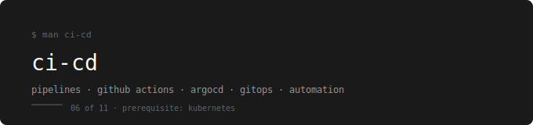

  

[← devops-runbook](../../README.md)

---

Pipelines, automation, and GitOps — built around the webstore app that you containerized in Docker and orchestrated in Kubernetes.

---

## Why CI-CD — and Why GitHub Actions + ArgoCD

Every `kubectl apply` you ran in Kubernetes was a manual step. You typed it, you watched it, you waited. In a real team that is not sustainable — deployments happen dozens of times a day, from multiple people, across multiple environments. One missed step, one wrong image tag, one manual mistake is enough to break production.

CI-CD removes the human from the deployment loop. Code gets pushed, a pipeline runs, an image gets built and tagged, and the cluster updates itself — without anyone typing a single command.

GitHub Actions is the CI layer. It is built into the repo. No separate server. No extra billing. It triggers on the events you define — a push to main, a pull request, a tag — and runs whatever steps you tell it to. For this runbook it builds the webstore-api image, tags it with the git commit SHA, and pushes it to the registry.

ArgoCD is the CD layer. It watches a Git repository containing Kubernetes manifests. When the manifests change — because the CI pipeline updated the image tag — ArgoCD detects the difference between what is in Git and what is running in the cluster, and syncs them. The cluster always reflects what is in Git. That is GitOps.

Jenkins runs CI-CD too, but it requires a dedicated server, ongoing maintenance, and a plugin ecosystem that ages poorly. CircleCI and GitLab CI are solid tools but add separate accounts and ecosystems when the team is already on GitHub. Flux does GitOps like ArgoCD but has a smaller community and a steeper CLI learning curve. For a team on GitHub running Kubernetes, Actions + ArgoCD is the cleanest combination.

---

## Prerequisites

**Complete first:** [05. Kubernetes – Orchestration](../05.%20Kubernetes%20–%20Orchestration/README.md)

ArgoCD deploys to a Kubernetes cluster. GitHub Actions builds images that run in Kubernetes. If you do not have a working cluster and a deployed webstore, CI-CD has nothing to automate.

---

## The Running Example

Every file and every lab is built around the webstore app.

| Service | Image | Registry |
|---|---|---|
| webstore-api | custom image | Docker Hub (learning) → ECR (production) |
| webstore-frontend | nginx:1.24 | Docker Hub |
| webstore-db | postgres:15 | Docker Hub |

---

## Where You Take the Webstore

You arrive at CI-CD with the webstore running on a Kubernetes cluster. Deployments work. Pods self-heal. Storage persists. But every update requires you to manually build an image, push it, and apply the manifest.

You leave with a pipeline that does all of that automatically. Push code to main — the pipeline builds the image, tags it with the commit SHA, pushes it to the registry, updates the manifest, and ArgoCD deploys it to the cluster. The only manual step left is writing the code.

---

## Why Two Repos

This tool introduces the two-repo pattern. One repo holds your application code. A separate repo holds your Kubernetes manifests. The CI pipeline lives in the app repo and updates the manifest repo when a new image is built. ArgoCD watches the manifest repo.

This separation means the cluster's desired state is always in Git, independent of the application code. Rolling back is a git revert on the manifest repo. Auditing who deployed what and when is a git log.

---

## Phases

| # | Phase | Topics | Lab |
|---|---|---|---|
| 01 | [What is CI-CD](./01-what-is-cicd/README.md) | The problem with manual deployments, CI vs CD, the pipeline mental model | No lab |
| 02 | [GitHub Actions](./02-github-actions/README.md) | Workflow file anatomy, triggers, jobs, steps, secrets, environment variables | [Lab 01](./cicd-labs/01-github-actions-lab.md) |
| 03 | [Docker Build & Push](./03-docker-build-push/README.md) | `docker/build-push-action`, git SHA tagging, registry authentication in CI | [Lab 01](./cicd-labs/01-github-actions-lab.md) |
| 04 | [ArgoCD](./04-argocd/README.md) | GitOps concept, install on Minikube, Application object, sync policies, health status | [Lab 02](./cicd-labs/02-argocd-lab.md) |
| 05 | [Full Pipeline](./05-full-pipeline/README.md) | Connecting CI to CD — push triggers build, image tag updated, ArgoCD deploys | [Lab 03](./cicd-labs/03-full-pipeline-lab.md) |

---

## Labs

| Lab | Topics Covered | What You Practice |
|---|---|---|
| [Lab 01](./cicd-labs/01-github-actions-lab.md) | GitHub Actions + Docker Build & Push | Write the webstore-api pipeline from scratch, trigger it with a push, watch it build and push the image |
| [Lab 02](./cicd-labs/02-argocd-lab.md) | ArgoCD | Install ArgoCD on Minikube, create the Application object, connect it to the manifests repo, trigger a sync |
| [Lab 03](./cicd-labs/03-full-pipeline-lab.md) | Full Pipeline | Push a code change, watch the pipeline build and push the image, watch ArgoCD detect the change and deploy it |

---

## What You Can Do After This

- Write a GitHub Actions workflow from scratch without documentation
- Build, tag, and push a Docker image from a CI pipeline
- Explain the difference between CI and CD and why they are separate
- Install and configure ArgoCD on a Kubernetes cluster
- Explain GitOps and why Git is the source of truth for cluster state
- Connect a CI pipeline to a CD system so deployments happen automatically
- Roll back a deployment by reverting a commit in the manifests repo
- Debug a failed pipeline run by reading GitHub Actions logs

---

## How to Use This

Read phases in order. Each one builds on the previous.
After each phase do the lab before moving on.
The checklist at the end of every lab is not optional.

---

## What Comes Next

→ [07. Observability – Monitoring & Logs](../07.%20Observability%20–%20Monitoring%20%26%20Logs/README.md)

CI-CD deploys the webstore automatically. Observability tells you what is happening inside it after it is deployed — whether pods are healthy, whether requests are failing, and where to look when they are.
