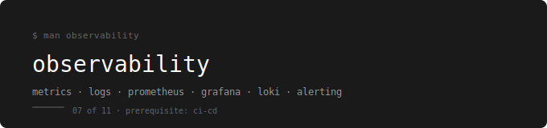

  

[← devops-runbook](../../README.md)

---

Metrics, logs, and alerting — built around the webstore running on Kubernetes, deployed by the CI-CD pipeline.

---

## Why Observability — and Why Prometheus + Grafana + Loki

The pipeline deploys your code. Kubernetes keeps it running. But neither of them tells you what the application is actually doing. Is the webstore-api responding in under 200ms? Did three pods restart in the last hour? Did the database run out of connections at 2am? Without observability, the answer to all of those is: you find out when a user complains.

Observability is the practice of instrumenting a system so you can answer those questions from the outside — without SSH-ing into pods, without reading raw logs manually, without waiting for someone to notice something is wrong.

Prometheus collects metrics. Every pod exposes a `/metrics` endpoint and Prometheus scrapes it on a schedule. You query those metrics with PromQL to understand CPU, memory, request rates, error rates, and anything else your application exposes.

Grafana visualises the data. It connects to Prometheus as a data source and lets you build dashboards — panels showing exactly what you want to see. It also connects to Loki for logs, meaning one UI for everything.

Loki stores logs. Every pod writes to stdout. Promtail collects those logs from the node and ships them to Loki. You query them with LogQL — same mental model as PromQL, but for log lines instead of numbers.

The reason this stack is standard is that kube-prometheus-stack is a single Helm chart that installs Prometheus, Grafana, Alertmanager, and all the Kubernetes dashboards in one command. Loki-stack adds Loki and Promtail in another. Datadog does all of this too, but at a cost that rules it out for most teams and all learning environments. The ELK stack handles logs but adds Elasticsearch and Kibana on top of what you already have — separate configuration, separate query language, separate billing. The PLG stack (Prometheus + Loki + Grafana) runs on the same cluster you already have, uses one UI, and is what cloud-native companies actually run.

---

## Prerequisites

**Complete first:** [06. CI-CD – Pipelines & GitOps](../06.%20CI-CD%20–%20Pipelines%20%26%20GitOps/README.md)

You need a running cluster with a deployed webstore before observability makes sense. There is nothing to observe without a running application — and the CI-CD pipeline is what keeps it deployed and updated.

---

## The Running Example

Every file and every lab is built around the webstore app running on Kubernetes.

| What gets instrumented | What you observe |
|---|---|
| webstore-api pods | Request rate, error rate, response time, restart count |
| webstore-db pods | Connection count, query time, memory usage |
| webstore-frontend pods | CPU and memory, pod health |
| Cluster nodes | Node CPU, memory, disk pressure |

---

## Where You Take the Webstore

You arrive at Observability with the webstore running on Kubernetes and deploying automatically through ArgoCD. It works — but you have no visibility into whether it is working well. You cannot answer basic operational questions without manually running kubectl commands.

You leave with Prometheus scraping every webstore pod, Grafana showing dashboards for the entire cluster and the webstore specifically, Loki holding every log line from every container, and an alert that fires when a pod crashes or when the API error rate spikes. You can answer any operational question about the webstore from Grafana without touching the cluster.

---

## The Three Pillars

Observability is built on three data types. You need all three — each one answers a different question.

**Metrics** answer: is something wrong, and how wrong is it? A number over time. CPU at 94%. 500 errors per minute. Pod restart count is 7. Metrics tell you a fire exists and how big it is.

**Logs** answer: what happened, and when exactly? A timestamped event from inside the application. `[ERROR] database connection refused`. `[WARN] response time exceeded 2000ms`. Logs tell you what the fire looks like up close.

**Traces** answer: which service caused it? The path a single request took through every service — how long each hop took, where it failed. Traces are covered conceptually here but not hands-on. Entry level does not implement distributed tracing, but you must know it exists and what problem it solves.

---

## Phases

| # | Phase | Topics | Lab |
|---|---|---|---|
| 01 | [What is Observability](./01-what-is-observability/README.md) | Three pillars, metrics vs logs vs traces, the incident mental model | No lab |
| 02 | [Prometheus](./02-prometheus/README.md) | Pull model, /metrics endpoint, PromQL essentials, alert rules, Alertmanager | [Lab 01](./observability-labs/01-prometheus-lab.md) |
| 03 | [Grafana](./03-grafana/README.md) | Data source connection, pre-built K8s dashboards, custom panels, Grafana alerts | [Lab 02](./observability-labs/02-grafana-lab.md) |
| 04 | [Loki](./04-loki/README.md) | Promtail log collection, LogQL basics, install via loki-stack Helm chart | [Lab 03](./observability-labs/03-loki-lab.md) |
| 05 | [Incident Workflow](./05-incident-workflow/README.md) | Full loop: alert fires → Grafana dashboard → Prometheus metrics → Loki logs → fix | [Lab 04](./observability-labs/04-incident-lab.md) |

---

## Labs

| Lab | Topics Covered | What You Practice |
|---|---|---|
| [Lab 01](./observability-labs/01-prometheus-lab.md) | Prometheus | Install kube-prometheus-stack via Helm, verify scraping, write four essential PromQL queries |
| [Lab 02](./observability-labs/02-grafana-lab.md) | Grafana | Connect to Prometheus, explore pre-built dashboards, build a custom webstore-api panel, set a pod restart alert |
| [Lab 03](./observability-labs/03-loki-lab.md) | Loki | Install loki-stack via Helm, connect Loki to Grafana, query webstore logs with LogQL |
| [Lab 04](./observability-labs/04-incident-lab.md) | Full Incident Workflow | Break the webstore on purpose, follow the alert → dashboard → logs → fix loop end to end |

---

## What You Can Do After This

- Explain the three observability pillars and what question each one answers
- Install the full PLG stack on a Kubernetes cluster with two Helm commands
- Query Prometheus with PromQL to answer real operational questions
- Read and navigate the pre-built Kubernetes Grafana dashboards
- Build a custom Grafana panel for a specific application metric
- Query pod logs from Loki using LogQL without kubectl logs
- Set an alert rule that fires when a pod crashes or error rate spikes
- Follow the complete incident workflow from alert to resolution

---

## How to Use This

Read phases in order. Each one builds on the previous.
After each phase do the lab before moving on.
The checklist at the end of every lab is not optional.

---

## What Comes Next

→ [08. AWS – Cloud Infrastructure](../08.%20AWS%20–%20Cloud%20Infrastructure/README.md)

Observability gives you visibility into the local cluster. AWS is where you take everything — the cluster, the database, the pipeline, the monitoring — and run it in production on managed infrastructure. Everything you have built so far runs on a laptop. AWS makes it run for real users.
