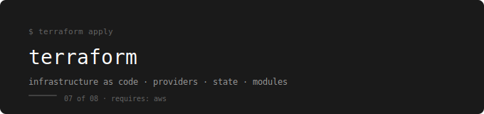

  

[← devops-runbook](../../README.md)

---

Infrastructure as code — defining the AWS resources that run the webstore as `.tf` files instead of console clicks.

---

## Why Terraform — and Why Not CloudFormation or Pulumi

Every AWS resource you created in the previous tool was done manually — console clicks, CLI commands, configuration spread across a browser and a terminal. That works once. It does not work when you need to recreate the same environment for staging, or when someone asks you to prove that production matches what was documented six months ago, or when you need to tear everything down and rebuild it cleanly.

Terraform solves this by making infrastructure declarative. You write `.tf` files that describe what should exist. Terraform reads them, compares against what actually exists in AWS, and makes only the changes needed to reach that state. The entire webstore infrastructure — VPC, subnets, EKS cluster, RDS instance, security groups, IAM roles — becomes a set of files you can version control, review in a pull request, and apply in one command.

CloudFormation is AWS-native and requires no additional tooling, but it is verbose, JSON/YAML-heavy, and locked to AWS. If you ever touch another cloud provider, CloudFormation does not help. Pulumi uses real programming languages (Python, TypeScript) which is powerful but adds the overhead of a runtime, dependency management, and language-specific tooling for what is fundamentally a configuration problem. Terraform's HCL is readable enough to be approachable and structured enough to be consistent. It is what the majority of DevOps job descriptions mean when they say IaC.

---

## Prerequisites

**Complete first:** [08. AWS – Cloud Infrastructure](../08.%20AWS%20–%20Cloud%20Infrastructure/README.md)

Terraform provisions AWS resources. If you do not understand what a VPC is, what an EKS cluster needs to run, or how IAM roles work — you cannot write correct Terraform. You need to have created these resources manually at least once before automating them.

---

## The Running Example

Every file and every lab provisions infrastructure for the webstore app.

| What you provision | AWS resource | Terraform resource |
|---|---|---|
| Network | VPC, subnets, route tables, IGW, NAT | `aws_vpc`, `aws_subnet`, `aws_route_table` |
| Cluster | EKS cluster and node groups | `aws_eks_cluster`, `aws_eks_node_group` |
| Database | RDS PostgreSQL | `aws_db_instance` |
| Registry | ECR repository for webstore-api | `aws_ecr_repository` |
| Access | IAM roles and policies | `aws_iam_role`, `aws_iam_policy` |

---

## Where You Take the Webstore

You arrive at Terraform having built the webstore AWS infrastructure manually. It works, but it is not reproducible. If something goes wrong, rebuilding it from scratch means remembering every decision you made.

You leave with the entire webstore AWS infrastructure defined as Terraform code. One `terraform apply` creates everything from a blank AWS account. One `terraform destroy` removes it cleanly. The infrastructure is version controlled, reviewable, and identical every time it is applied.

---

## Why This Order of Phases

Core workflow first — so you understand what Terraform actually does before writing resource definitions. State before modules — so you understand what Terraform is tracking before you abstract it. Real-world project last — so every concept has been introduced before you use it together.

---

## Phases

| # | Phase | Topics | Lab |
|---|---|---|---|
| 01 | [What is Terraform](./01-what-is-terraform/README.md) | IaC concept, declarative vs imperative, how Terraform fits the DevOps workflow | No lab |
| 02 | [Core Workflow](./02-core-workflow/README.md) | `terraform init`, `plan`, `apply`, `destroy` — the four commands you use every day | [Lab 01](./terraform-labs/01-core-workflow-lab.md) |
| 03 | [Providers & Resources](./03-providers-resources/README.md) | Provider block, resource block, data sources, resource dependencies | [Lab 01](./terraform-labs/01-core-workflow-lab.md) |
| 04 | [Variables & Outputs](./04-variables-outputs/README.md) | Input variables, output values, locals, `.tfvars` files, variable types | [Lab 02](./terraform-labs/02-variables-state-lab.md) |
| 05 | [State](./05-state/README.md) | The state file, what it tracks, remote state with S3 + DynamoDB locking | [Lab 02](./terraform-labs/02-variables-state-lab.md) |
| 06 | [Modules](./06-modules/README.md) | Root module, child modules, the Terraform Registry, writing reusable modules | [Lab 03](./terraform-labs/03-modules-lab.md) |
| 07 | [Loops & Conditionals](./07-loops-conditionals/README.md) | `count`, `for_each`, `dynamic` blocks, conditional expressions | [Lab 03](./terraform-labs/03-modules-lab.md) |
| 08 | [Real-World Project](./08-real-world/README.md) | Full webstore AWS infrastructure in Terraform — VPC, EKS, RDS, ECR, IAM | [Lab 04](./terraform-labs/04-webstore-infra-lab.md) |

---

## Labs

| Lab | Topics Covered | What You Practice |
|---|---|---|
| [Lab 01](./terraform-labs/01-core-workflow-lab.md) | Core Workflow, Providers, Resources | Write your first provider block, create a real AWS resource, run init/plan/apply/destroy |
| [Lab 02](./terraform-labs/02-variables-state-lab.md) | Variables, Outputs, State | Parameterise a configuration, add outputs, move state to S3 with DynamoDB locking |
| [Lab 03](./terraform-labs/03-modules-lab.md) | Modules, Loops, Conditionals | Extract a VPC into a reusable module, use `for_each` to create multiple subnets |
| [Lab 04](./terraform-labs/04-webstore-infra-lab.md) | Real-World Project | Provision the full webstore AWS infrastructure — VPC, EKS, RDS, ECR — in one `terraform apply` |

---

## What You Can Do After This

- Explain what Terraform state is and why it exists
- Run `terraform init`, `plan`, `apply`, and `destroy` confidently
- Write provider and resource blocks for common AWS services
- Use variables, outputs, and locals to make configurations reusable
- Store Terraform state remotely in S3 with DynamoDB locking
- Write a reusable module and call it from a root module
- Use `count` and `for_each` to avoid repetition
- Provision a complete multi-tier AWS environment from scratch

---

## How to Use This

Read phases in order. Each one builds on the previous.
After each phase do the lab before moving on.
The checklist at the end of every lab is not optional.

---

## What Comes Next

→ [10. Ansible – Configuration Management](../10.%20Ansible%20–%20Configuration%20Management/README.md)

Terraform provisions the infrastructure. Ansible configures what runs on it. Once EC2 instances are running, Ansible connects over SSH and installs packages, manages services, pushes config files, and enforces the state of every server — without touching them manually.
