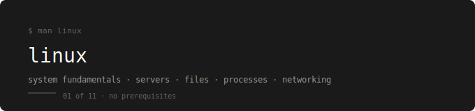

<p align="center">
  
</p>

[← devops-runbook](../../README.md)

---

A production-focused Linux guide built around one running example.
No certification fluff. No desktop Linux. Only what you actually use on servers.

---

## Prerequisites

None. This is the first folder in the series.  
All you need is a Linux terminal — a VM, WSL, or a cloud instance works fine.

---

## The Running Example

Every lab uses the same webstore project:

```
~/webstore/
├── frontend/       ← static files served by nginx
├── api/            ← application code
├── db/             ← database schemas
├── logs/           ← access.log, error.log
├── config/         ← webstore.conf
└── backup/         ← archives
```

By the end you will have set correct permissions on this directory, searched its logs with grep and awk, archived it with tar, installed nginx to serve it, and debugged it over the network with curl and tcpdump.

---

## Phases

| Phase | Topics | Lab |
|---|---|---|
| 0 — Foundation | [01 Boot Process](./01-boot-process/README.md) · [02 Basics](./02-basics/README.md) · [03 Files](./03-working-with-files/README.md) | [Lab 01](./linux-labs/01-boot-basics-files-lab.md) |
| 1 — Text Processing | [04 Filters](./04-filter-commands/README.md) · [05 sed](./05-sed-stream-editor/README.md) · [06 awk](./06-awk/README.md) | [Lab 02](./linux-labs/02-filters-sed-awk-lab.md) |
| 2 — System Admin | [07 Vim](./07-text-editor/README.md) · [08 Users](./08-user-&-group-management/README.md) · [09 Permissions](./09-file-ownership-&-permissions/README.md) | [Lab 03](./linux-labs/03-vim-users-permissions-lab.md) |
| 3 — Operations | [10 Archive](./10-archiving-and-compression/README.md) · [11 Packages](./11-package-management/README.md) · [12 Services](./12-service-management/README.md) | [Lab 04](./linux-labs/04-archive-packages-services-lab.md) |
| 4 — Networking | [13 Networking](./13-networking/README.md) | [Lab 05](./linux-labs/05-networking-lab.md) |

---

## Labs

| Lab | Covers |
|---|---|
| [Lab 01](./linux-labs/01-boot-basics-files-lab.md) | Boot inspection, filesystem navigation, webstore directory setup, file operations |
| [Lab 02](./linux-labs/02-filters-sed-awk-lab.md) | grep, find, cut, sort, uniq, sed, awk — all on webstore logs |
| [Lab 03](./linux-labs/03-vim-users-permissions-lab.md) | vim editing, user/group creation, ownership and permission control |
| [Lab 04](./linux-labs/04-archive-packages-services-lab.md) | tar/gzip backup, nginx install, systemctl full lifecycle, config management |
| [Lab 05](./linux-labs/05-networking-lab.md) | ip, ping, traceroute, dig, curl, ss, tcpdump — all against the running nginx |

---

## How to Use This

Read phases in order. Each one builds on the previous.  
After each phase do the lab before moving on.  
The checklist at the end of every lab is not optional.

---

## What You Can Do After This

- Navigate any Linux server confidently without a GUI
- Search and analyze log files to debug real incidents
- Create users, groups, and set correct file permissions
- Install software, manage services, and configure nginx
- Use curl, dig, ss, and tcpdump to debug network issues
- Archive and restore directories for backups and deployments

---

## What Comes Next

→ [02. Git & GitHub – Version Control](../02.%20Git%20%26%20GitHub%20–%20Version%20Control/README.md)

Linux gives you the server foundation. Git gives you the workflow foundation — version control, collaboration, and the habit of tracking every change you make to infrastructure and code.
