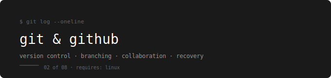

  

[← devops-runbook](../../README.md)

---

Version control, branching, collaboration, and recovery — built around one real project from first commit to open-source contribution workflow.

---

## Prerequisites

**Complete first:** [01. Linux – System Fundamentals](../01.%20Linux%20–%20System%20Fundamentals/README.md)

You need to be comfortable in the terminal — navigating directories, editing files with vim, and running commands — before Git will make sense as a tool.

---

## The Running Example

Every lab uses the same webstore project — the same app from Linux.  
You initialize it as a Git repo, build its history commit by commit, branch and merge features, and push to GitHub.

---

## Topics

| # | File | What You Learn |
|---|---|---|
| 01 | [Foundations](./01-foundations/README.md) | Install, config, init, staging, commits, `.gitignore`, push |
| 02 | [Stash & Tags](./02-stash-tags/README.md) | Pause work safely, mark release versions |
| 03 | [History & Branching](./03-history-branching/README.md) | Read history, branches, merge, rebase, branching strategies |
| 04 | [Contribute](./04-contribute/README.md) | Feature branch PRs, fork workflow, remotes |
| 05 | [Undo & Recovery](./05-undo-recovery/README.md) | Amend, revert, reset, reflog |

---

## Labs

| Lab | Covers |
|---|---|
| [Lab 01](./git-labs/01-foundations-lab.md) | Init repo, configure identity, .gitignore, first commits, push to GitHub |
| [Lab 02](./git-labs/02-stash-tags-lab.md) | Stash mid-work, restore, tag releases, push tags |
| [Lab 03](./git-labs/03-history-branching-lab.md) | Read history, fast-forward merge, 3-way merge, conflict resolution, rebase |
| [Lab 04](./git-labs/04-contribute-lab.md) | Feature branch PR workflow, fork, upstream remote, sync fork |
| [Lab 05](./git-labs/05-undo-recovery-lab.md) | Amend commits, revert bad commits, reset, recover with reflog |

---

## How to Use This

Read topics in order. After each one do the lab before moving on.  
The checklist at the end of every lab is not optional.

---

## What You Can Do After This

- Track and version any project with confidence
- Write clean commit history that teammates can read
- Create and merge branches without breaking anything
- Resolve merge conflicts without panicking
- Rebase feature branches to keep history linear
- Recover from any mistake using reflog
- Contribute to team repos and open-source projects via PRs
- Tag releases that CI/CD pipelines can reference

---

## What Comes Next

→ [03. Networking – Foundations](../03.%20Networking%20–%20Foundations/README.md)

Git gives you version control for code. Networking gives you the foundation that makes Docker, Kubernetes, and AWS actually make sense — bridge networks, DNS resolution, NAT, and firewalls are not magic once you understand how packets travel.
