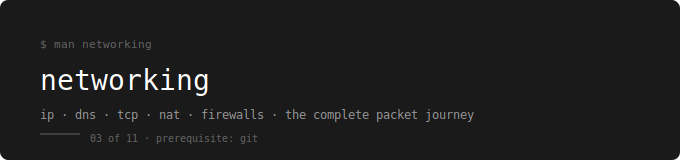

  

[← devops-runbook](../../README.md)

---

A practical networking guide built for DevOps and cloud engineering roles.  
No CCNA fluff. Only what you actually use — and only what Docker and AWS build on top of.

---

## Prerequisites

**Complete first:** [02. Git & GitHub – Version Control](../02.%20Git%20%26%20GitHub%20–%20Version%20Control/README.md)

You need Git to version your lab work and notes as you go through this series.

---

## Why Networking Comes Before Docker and AWS

Docker bridge networking, container DNS, and port binding are all networking concepts in a container wrapper. AWS VPC, Security Groups, NAT Gateway, and Route 53 are all networking concepts in a cloud wrapper.

If you learn Docker or AWS before networking, those tools feel like magic. Magic breaks in production without warning. This folder removes the magic — everything Docker and AWS do with networking has its foundation explained here first.

---

## The Running Example

Every scenario uses the same webstore application:
- User opens webstore.com from their laptop
- Traffic flows through DNS, NAT, routing, VPC, load balancer, security groups
- By file 10 you can trace every single hop of that journey

---

## Phases

| Phase | Topics | Lab |
|---|---|---|
| 1 — Foundation | [01 Foundation & Big Picture](./01-foundation-and-the-big-picture/README.md) · [02 Addressing](./02-addressing-fundamentals/README.md) · [03 IP Deep Dive](./03-ip-deep-dive/README.md) | [Lab 01](./networking-labs/01-foundation-addressing-ip-lab.md) |
| 2 — Routing | [04 Network Devices](./04-network-devices/README.md) · [05 Subnets & CIDR](./05-subnets-cidr/README.md) | [Lab 02](./networking-labs/02-devices-subnets-lab.md) |
| 3 — Transport & NAT | [06 Ports & Transport](./06-ports-transport/README.md) · [07 NAT & Translation](./07-nat/README.md) | [Lab 03](./networking-labs/03-ports-transport-nat-lab.md) |
| 4 — DNS & Firewalls | [08 DNS](./08-dns/README.md) · [09 Firewalls & Security](./09-firewalls/README.md) | [Lab 04](./networking-labs/04-dns-firewalls-lab.md) |
| 5 — Complete Journey | [10 Complete Journey](./10-complete-journey/README.md) | [Lab 05](./networking-labs/05-complete-journey-lab.md) |

---

## Labs

| Lab | Topics Covered | What You Practice |
|---|---|---|
| [Lab 01](./networking-labs/01-foundation-addressing-ip-lab.md) | Foundation · Addressing · IP | ip addr, ARP table, MAC vs IP, private ranges, localhost |
| [Lab 02](./networking-labs/02-devices-subnets-lab.md) | Network Devices · Subnets | Routing table, traceroute, CIDR calculation, subnet design |
| [Lab 03](./networking-labs/03-ports-transport-nat-lab.md) | Ports · Transport · NAT | ss, TCP handshake, iptables DNAT proof |
| [Lab 04](./networking-labs/04-dns-firewalls-lab.md) | DNS · Firewalls | dig +trace, nslookup, iptables rules, stateful vs stateless |
| [Lab 05](./networking-labs/05-complete-journey-lab.md) | Complete Journey | Full end-to-end trace: DNS + routing + ports + firewalls |

---

## Reference

[Networking Map](./00-networking-map/README.md) — single-page cheat sheet, use before interviews and when debugging

---

## Critical Concepts

**The Big Three — understand these before moving on:**

1. **MAC vs IP** — MAC changes at every router hop, IP never changes end to end
2. **Stateful vs Stateless** — stateful firewalls auto-allow return traffic, stateless don't — this causes the most common AWS NACL failures
3. **Encapsulation** — each layer wraps the previous (Frame → Packet → Segment → Data)

---

## What You Can Do After This

- Design subnets and calculate CIDR blocks correctly
- Debug "can't connect" issues systematically layer by layer
- Understand what Docker bridge, DNS, and port binding actually do
- Understand what AWS VPC, Security Groups, and NAT Gateway actually do
- Set up firewall rules without breaking applications
- Trace a full packet journey from browser to server

---

## What Comes Next

This folder feeds directly into two tools:

→ [04. Docker – Containerization](../04.%20Docker%20–%20Containerization/README.md)  
Docker bridge networks, container DNS, and port binding are all built on the NAT, DNS, and routing concepts from this folder.

→ [06. AWS – Cloud Infrastructure](../06.%20AWS%20–%20Cloud%20Infrastructure/README.md)  
AWS VPC, Security Groups, NACLs, and NAT Gateway are all built on the subnetting, firewall, and NAT concepts from this folder.
