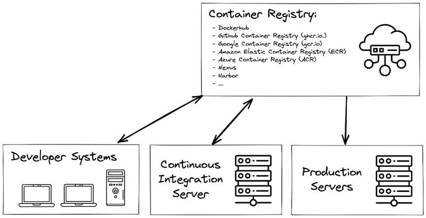
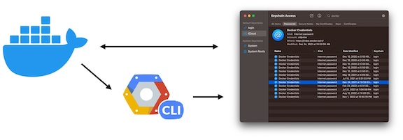

[Home](../README.md) |
[History & Motivation](../01-history-and-motivation/README.md) |
[Technology Overview](../02-technology-overview/README.md) |
[Docker Containers](../03-docker-containers/README.md) |
[Port Binding](../04-docker-port-binding/README.md) |
[Networking](../05-docker-networking/README.md) |
[Volumes](../06-docker-volumes/README.md) |
[Layers](../07-docker-layers/README.md) |
[Build](../08-docker-build-dockerfile/README.md) |
[Registry](../09-docker-registry/README.md) |
[Compose](../10-docker-compose/README.md) |
[Interview Prep](../99-interview-prep/README.md)

# Container Registries

## 1) What a Container Registry Is

A container registry is a **remote storage system for Docker images**.

It stores images so they can be:
- pushed by developers
- pulled by CI systems
- pulled by production servers

It does **not** run containers.

---

## 2) Why Registries Exist

Without a registry:
- images live only on your laptop
- CI cannot access them
- production cannot pull them

With a registry:
- one image
- reused everywhere
- no rebuild drift

---

## 3) Visual Mental Model (Registry as the Hub)



What this image shows:

**Developer systems**
- Push → very common (after build)
- Pull → very common (base images, debugging)

**CI servers**
- Pull → always (to test, scan, deploy)
- Push → often (build pipelines, versioned images)

**Production servers**
- Pull → yes (to run images)
- Push → almost never (anti-pattern)

Key idea:
The registry is **passive storage**.
Everything else initiates communication.

**The Only Flow That Matters**
```
Developer ↔ Registry ↔ CI → Production
```
Same image. Different environments.

---

## 4) Common Container Registries (Awareness Only)

Examples you will see in real systems:
- Docker Hub
- GitHub Container Registry (ghcr.io)
- GitLab Container Registry
- Google Container Registry (gcr.io)
- Amazon Elastic Container Registry (ECR)
- Azure Container Registry (ACR)
- JFrog Artifactory
- Nexus
- Harbor

You do not need to learn each one now.
They all solve the same problem.

---

## 5) Public vs Private Images

Public images:
- anyone can pull
- no authentication required

Private images:
- authentication required
- commonly used in CI and production

This explains why login exists.

---

## 6) Authentication

To push or pull private images:
```bash
docker login
```

What happens:

* credentials are sent to the registry
* Docker stores them securely
* future pulls/pushes work automatically

Where credentials live:

* macOS Keychain
* Windows Credential Manager
* Linux credential helpers

---

## 7) Authentication Visual



What this image shows:

* Docker CLI requesting credentials
* OS credential store handling secrets
* Registry validating access

You do not manage tokens manually at this stage.

---

## 8) Tagging Strategy — How Real Teams Version Images

Tags are not just labels. They are the mechanism CI/CD pipelines use to decide what to deploy. A poorly thought-out tagging strategy causes deployments to pull stale images, makes rollbacks difficult, and makes production incidents harder to debug.

**The `latest` trap:**

`latest` is the default tag when no tag is specified. It sounds useful but causes serious problems in real pipelines:

```bash
# This is what latest actually means:
docker push myrepo/webstore-api:latest
# "latest" = whatever was pushed most recently
# NOT "the most stable version"
# NOT "the version that passed QA"
# NOT reproducible — tomorrow it may be a different image

# Three weeks later on production:
docker pull myrepo/webstore-api:latest
# What did you just pull? Impossible to know without checking the registry.
# If it breaks, what do you roll back to?
```

**The rule:** never deploy `latest` to production. Always deploy a specific, immutable tag.

**Semantic versioning tags — the standard for releases:**

```
v1.0.0    ← major.minor.patch
v1.1.0    ← new feature, backward compatible
v1.1.1    ← bug fix
v2.0.0    ← breaking change
```

```bash
# Tag and push a release
docker build -t webstore-api:v1.0.0 .
docker tag webstore-api:v1.0.0 akhiltejadoosari/webstore-api:v1.0.0
docker push akhiltejadoosari/webstore-api:v1.0.0
```

**Git SHA tags — the standard for CI/CD:**

Every commit produces an image. Tag it with the Git commit SHA so you can trace any deployed image back to the exact commit that built it.

```bash
# In a CI pipeline:
GIT_SHA=$(git rev-parse --short HEAD)
docker build -t webstore-api:${GIT_SHA} .
docker push akhiltejadoosari/webstore-api:${GIT_SHA}

# Example output:
# akhiltejadoosari/webstore-api:a3f92c1
```

When production has a bug, you check the deployed tag (`a3f92c1`), run `git show a3f92c1`, and see exactly what changed.

**Environment tags — for promotion workflows:**

Some teams tag images with the environment they are deployed to:

```bash
# Tag the same image for staging
docker tag webstore-api:v1.0.0 akhiltejadoosari/webstore-api:staging

# Promote to production after QA passes
docker tag webstore-api:v1.0.0 akhiltejadoosari/webstore-api:production
```

The underlying image is identical — only the tag changes. This makes rollback trivial: retag the previous version as `production` and redeploy.

**Tagging decision table:**

| Context | Tag to use | Example |
|---|---|---|
| Every CI build | Git SHA | `webstore-api:a3f92c1` |
| Versioned releases | Semantic version | `webstore-api:v1.0.0` |
| Current stable dev | `latest` | Only for local development |
| Production deploy | Specific SHA or semver | Never `latest` |
| Environment tracking | Environment name | `webstore-api:staging` |

**One-line rule:**
In production, every image tag must be immutable and traceable — either a Git SHA or a semantic version. `latest` is for local development only.

---

## 9) Publish webstore-api to Docker Hub (End-to-End Process)

Goal:
- Take the local image you built in section 08 (`webstore-api:1.0`)
- Publish it to Docker Hub so other machines and CI can pull it

This section includes:
- Docker Hub UI steps (create repository)
- Terminal steps (build, login, tag, push, verify)

---

### Step 0: Prerequisites (Docker Hub)

1) Sign in to Docker Hub (website).
2) Create a repository:
   - Name: `webstore-api`
   - Visibility: Public or Private (your choice)
3) After creation, your image target will look like:
   - `DOCKERHUB_USERNAME/webstore-api`

You can add your own screenshots here (recommended).

---

### Step 1: Ensure the Image Exists Locally

Check local images:

```bash
docker images
```

Look for:

* `webstore-api` under `REPOSITORY`
* a tag like `1.0`

If you do NOT see it, build it now (run this from the folder that contains your Dockerfile):

```bash
docker build -t webstore-api:1.0 .
```

Re-check:

```bash
docker images | head
```

---

### Step 2: Confirm Which Docker Account the Terminal Is Using

Docker can stay logged in from old sessions. Confirm current auth state:

```bash
docker info | grep -i username
```

If it prints a username, Docker is logged in.

---

### Step 3: Reset Login (Only When Needed)

Use this if:

* you see the wrong username
* push fails with permission errors
* you previously logged into a different account

Logout first:

```bash
docker logout
```

Now login again:

```bash
docker login
```

It will prompt for Docker Hub username and password (or token if you use one).

Verify again:

```bash
docker info | grep -i username
```

---

### Step 4: Tag the Image for Docker Hub

Docker Hub requires images to be tagged as:

```
DOCKERHUB_USERNAME/REPO_NAME:TAG
```

Tag your local image:

```bash
docker tag webstore-api:1.0 DOCKERHUB_USERNAME/webstore-api:1.0
```

Confirm the tag exists:

```bash
docker images | grep webstore-api
```

You should see both:

* `webstore-api:1.0`
* `DOCKERHUB_USERNAME/webstore-api:1.0`

---

### Step 5: Push the Image

Push to Docker Hub:

```bash
docker push DOCKERHUB_USERNAME/webstore-api:1.0
```

What happens:

* Docker checks which layers already exist in Docker Hub
* Only missing layers are uploaded
* Existing layers are reused

---

### Step 6: Verify Push Worked (Two Ways)

Terminal verification:

```bash
docker pull DOCKERHUB_USERNAME/webstore-api:1.0
```

Docker Hub verification:

* Open your repository page on Docker Hub
* Confirm the `1.0` tag exists

---

### Common Failure Modes (Fast Fix)

1. `denied: requested access to the resource is denied`
   - Cause: wrong Docker Hub username, not logged in, or repo not owned by you
   - Fix:
     ```bash
     docker logout
     docker login
     ```

2. `tag does not exist`
   - Cause: you tagged the wrong local image name or it was never built
   - Fix:
     ```bash
     docker build -t webstore-api:1.0 .
     docker tag webstore-api:1.0 DOCKERHUB_USERNAME/webstore-api:1.0
     ```

3. `unauthorized: authentication required`
   - Cause: not logged in or stale credentials
   - Fix:
     ```bash
     docker logout
     docker login
     ```

---

### Final Checkpoint

If you can do this from zero:

* build `webstore-api:1.0`
* create Docker Hub repo
* login correctly
* tag to `DOCKERHUB_USERNAME/webstore-api:1.0`
* push successfully

Then you understand container registries at the correct practical level.

**One-Line Definition**

> A container registry is a remote store for container images so the same image can be shared across development, CI, and production.

---

## What Breaks

| Symptom | Cause | First command to run |
|---|---|---|
| `denied: requested access to the resource is denied` | Wrong Docker Hub username in the tag, or not logged in | `docker logout` then `docker login` — retag with the correct username |
| `unauthorized: authentication required` | Credentials expired or never set | `docker login` — re-authenticate |
| Push succeeds but Kubernetes can't pull the image | Image is in a private registry but no pull secret is configured in the cluster | Confirm the repo visibility on Docker Hub — set to public for now |
| `tag does not exist` when pulling | Tag was never pushed, or you used the wrong tag name | `docker images` to see what tags exist locally — check Docker Hub UI for what was pushed |
| Layers upload on every push — nothing is reused | Base image tag changed (e.g., `node:20` resolved to a new digest) | Pin the base image with a specific digest or use a fixed tag like `node:20.11.0-alpine` |

---

## Daily Commands

| Command | What it does |
|---|---|
| `docker login` | Authenticate to Docker Hub — credentials stored by OS |
| `docker logout` | Remove stored credentials |
| `docker tag SOURCE TARGET` | Create a new tag pointing to the same image |
| `docker push USERNAME/IMAGE:TAG` | Upload image to registry |
| `docker pull USERNAME/IMAGE:TAG` | Download image from registry |
| `docker images` | List all local images and tags |
| `docker rmi IMAGE:TAG` | Delete a local image tag — does not affect the registry |

---

→ **Interview questions for this topic:** [99-interview-prep → Registry · Tagging · Push and Pull](../99-interview-prep/README.md#registry--tagging--push-and-pull)

→ Ready to practice? [Go to Lab 04](../docker-labs/04-registry-compose-lab.md)
