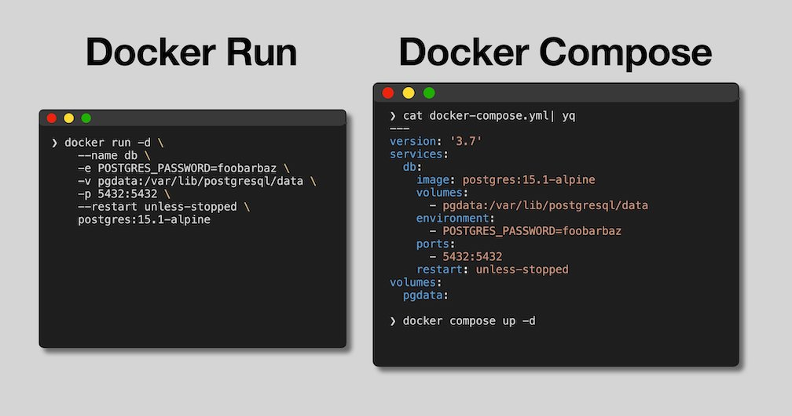

[Home](../README.md) |
[History & Motivation](../01-history-and-motivation/README.md) |
[Technology Overview](../02-technology-overview/README.md) |
[Docker Containers](../03-docker-containers/README.md) |
[Port Binding](../04-docker-port-binding/README.md) |
[Networking](../05-docker-networking/README.md) |
[Volumes](../06-docker-volumes/README.md) |
[Layers](../07-docker-layers/README.md) |
[Build](../08-docker-build-dockerfile/README.md) |
[Registry](../09-docker-registry/README.md) |
[Compose](../10-docker-compose/README.md) |
[Interview Prep](../99-interview-prep/README.md)

# Docker Compose — Same System, Automated

## 1) Mental Model First (What You Are About to Read)

Docker Compose replaces many manual `docker run` commands with **one file**.

Below is the **entire webstore system** in one view.

Do not analyze it yet.
Just observe the shape.

```yaml
version: "3.9"

services:
  webstore-db:
    image: postgres:15
    environment:
      POSTGRES_DB: webstore
      POSTGRES_USER: admin
      POSTGRES_PASSWORD: secret
    volumes:
      - webstore-db-data:/var/lib/postgresql/data

  adminer:
    image: adminer
    ports:
      - "8081:8080"
    depends_on:
      - webstore-db

  webstore-api:
    build: .
    ports:
      - "8080:8080"
    environment:
      DB_HOST: webstore-db
      DB_PORT: 5432
      DB_NAME: webstore
      DB_USER: admin
      DB_PASSWORD: secret
    depends_on:
      - webstore-db

volumes:
  webstore-db-data:
```

What this shows at a glance:

* Three containers
* One private Docker network (created automatically)
* Two ports exposed for human access (8080 for API, 8081 for DB UI)
* One database accessed internally by hostname
* One named volume for database persistence

Everything below explains **this file**, line by line.

---

## 2) What Docker Compose Is

Docker Compose runs a multi-container system using **one declarative file** instead of many imperative commands.

Compose does not add new concepts.
It automates:

* container creation
* Docker networking
* DNS (service names)
* port binding
* startup order
* volume creation

---

## 3) Services Block (System Definition)

```yaml
services:
```

Meaning:

* Start of all containers in this system
* Each service becomes:
  * one container
  * one DNS hostname
  * one isolated process

---

## 4) webstore-db Service (Database Server)

```yaml
  webstore-db:
```

Meaning:

* Service name
* Also becomes hostname `webstore-db`
* Used by other containers to connect

```yaml
    image: postgres:15
```

Meaning:

* Use PostgreSQL version 15 — pinned, not `latest`
* Pulled automatically if missing

```yaml
    environment:
      POSTGRES_DB: webstore
      POSTGRES_USER: admin
      POSTGRES_PASSWORD: secret
```

Meaning:

* Environment variables passed into the container
* PostgreSQL uses them on first startup to create the database and admin user

```yaml
    volumes:
      - webstore-db-data:/var/lib/postgresql/data
```

Meaning:

* Mount the named volume to PostgreSQL's data directory
* Data survives `docker compose down` — it is not deleted unless you explicitly remove the volume

Important:

* No `ports` section
* Database is internal-only
* Not reachable from your browser or the internet

---

## 5) adminer Service (Database UI)

```yaml
  adminer:
```

Meaning:

* Lightweight database management UI
* Supports PostgreSQL, MySQL, SQLite
* No configuration needed — connects using the form in the browser

```yaml
    image: adminer
```

Meaning:

* Uses the official adminer image

```yaml
    ports:
      - "8081:8080"
```

Meaning:

* adminer listens on port 8080 inside the container
* Host port `8081` forwards to container port `8080`
* Open `http://localhost:8081` in your browser to access the UI

```yaml
    depends_on:
      - webstore-db
```

Meaning:

* webstore-db container starts before adminer
* Controls start order only — does not guarantee the database is ready to accept connections

**How to use adminer:**
1. Open `http://localhost:8081`
2. System: PostgreSQL
3. Server: `webstore-db` (Docker DNS resolves this)
4. Username: `admin`
5. Password: `secret`
6. Database: `webstore`

---

## 6) webstore-api Service (Application)

```yaml
  webstore-api:
```

Meaning:

* Application container
* Hostname becomes `webstore-api`

```yaml
    build: .
```

Meaning:

* Builds image from Dockerfile in current directory
* Equivalent to `docker build .`

```yaml
    ports:
      - "8080:8080"
```

Meaning:

* Host port `8080` forwards to app port `8080`
* Required for browser access to the API

```yaml
    environment:
      DB_HOST: webstore-db
      DB_PORT: 5432
      DB_NAME: webstore
      DB_USER: admin
      DB_PASSWORD: secret
```

Meaning:

* Database connection details for the app
* Uses service name `webstore-db` — same rule as manual Docker networking
* Containers talk by name, never by IP

```yaml
    depends_on:
      - webstore-db
```

Meaning:

* Starts webstore-db before the app
* Prevents obvious startup failures
* Not a health check — the app may still need retry logic for DB connections

---

## 7) Volumes Block

```yaml
volumes:
  webstore-db-data:
```

Meaning:

* Declares the named volume at the top level
* Docker creates it if it does not exist
* Survives `docker compose down`
* Only deleted with `docker compose down -v` or `docker volume rm`

---

## 8) What Compose Creates Automatically

When you run:

```bash
docker compose up
```

Compose automatically creates:

* one bridge network named `<project>_default`
* DNS entries for each service
* containers attached to that network
* named volumes declared in the `volumes` block

You do not need to define networks explicitly for this setup.

---

## 9) Running the System

Start everything:

```bash
docker compose up
```

Start in background:

```bash
docker compose up -d
```

Stop and clean up containers and network (volumes survive):

```bash
docker compose down
```

Stop and delete everything including volumes:

```bash
docker compose down -v
```

**Warning:** `docker compose down -v` deletes the database volume. All data is gone. Use only when you want a completely clean reset.

---

## 10) About the `-f` Flag

Default behavior:

* Compose reads `docker-compose.yml`
* Also accepts `compose.yml`

`-f` selects a specific file:

```bash
docker compose -f docker-compose.prod.yml up
docker compose -f docker-compose.prod.yml down
```

Rule:
If the file is named `docker-compose.yml` and you are in that folder, do not use `-f`.

---

## 11) Manual vs Compose



Use manual Docker commands when:

* learning Docker
* debugging a single container
* understanding flags

Use Docker Compose when:

* running multi-container systems
* daily development
* you want reproducible setup

**Data flows (same as manual, just automated):**

App path:
```
Browser → localhost:8080 → webstore-api → webstore-db:5432 → webstore-db
```

Debug path:
```
Browser → localhost:8081 → adminer → webstore-db:5432 → webstore-db
```

One-line truth:
> webstore-api connects to webstore-db using hostname `webstore-db` on a Docker network.
Compose only automates the same configuration you already know.

---

## What Breaks

| Symptom | Cause | First command to run |
|---|---|---|
| `Bind for 0.0.0.0:8080 failed: port is already allocated` | Another container or process already owns that host port | `docker ps` to find it — `docker stop NAME` then retry |
| Service exits immediately after `docker compose up` | App crashed on startup — often a missing env var or wrong CMD | `docker compose logs SERVICE_NAME` to see the exit reason |
| `webstore-api` cannot connect to `webstore-db` | `DB_HOST` is set to `localhost` instead of the service name | Check `environment` block — must be `DB_HOST: webstore-db` not `localhost` |
| `docker compose down -v` deleted all database data | `-v` flag removes volumes — used when you wanted to keep data | Never use `-v` unless you explicitly want to wipe the database |
| Changes to `docker-compose.yml` not taking effect | Old containers still running with old config | `docker compose down` first, then `docker compose up -d` |

---

## Daily Commands

| Command | What it does |
|---|---|
| `docker compose up -d` | Start all services in the background |
| `docker compose down` | Stop and remove containers and network — volumes survive |
| `docker compose down -v` | Stop and remove everything including volumes — data is gone |
| `docker compose logs SERVICE` | View logs for a specific service |
| `docker compose logs -f SERVICE` | Follow live logs for a specific service |
| `docker compose ps` | List all containers managed by this Compose file |
| `docker compose exec SERVICE COMMAND` | Run a command inside a running service container |
| `docker compose build` | Rebuild images for services that use `build:` |

---

→ **Interview questions for this topic:** [99-interview-prep → Compose · depends_on · Networks and Volumes](../99-interview-prep/README.md#compose--dependson--networks-and-volumes)

→ Ready to practice? [Go to Lab 04](../docker-labs/04-registry-compose-lab.md)
