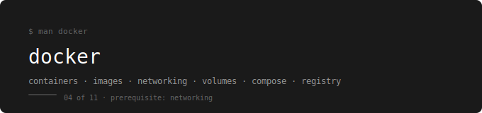

  

[← devops-runbook](../../README.md) |
[History & Motivation](./01-history-and-motivation/README.md) |
[Technology Overview](./02-technology-overview/README.md) |
[Containers](./03-docker-containers/README.md) |
[Port Binding](./04-docker-port-binding/README.md) |
[Networking](./05-docker-networking/README.md) |
[Volumes](./06-docker-volumes/README.md) |
[Layers](./07-docker-layers/README.md) |
[Build](./08-docker-build-dockerfile/README.md) |
[Registry](./09-docker-registry/README.md) |
[Compose](./10-docker-compose/README.md) |
[Interview](./99-interview-prep/README.md)

---

A fundamentals-first learning path for Docker — containers, networking, volumes, images, and Compose — built around one real app with no tutorial noise.

---

## Prerequisites

**Complete first:** [03. Networking – Foundations](../03.%20Networking%20–%20Foundations/README.md)

Specifically, before starting Docker you should understand:
- How bridges and routing work (file 04) — Docker bridge is a virtual switch
- NAT and port forwarding (file 07) — Docker `-p` flag creates iptables DNAT rules
- DNS resolution (file 08) — Docker has an embedded DNS server at `127.0.0.11`

Without these, Docker networking will feel like magic. Magic breaks in production.

---

## The Running Example

Every note, every lab, every command uses the same 3-tier app:

| Service | Image | Port |
|---|---|---|
| webstore-frontend | nginx:1.24 | 80 |
| webstore-api | nginx:1.24 (then custom) | 8080 |
| webstore-db | postgres:15 | 5432 |
| adminer | adminer | 8081 (dev only) |

By the end, this app is containerized, networked, persisted, built from a Dockerfile, pushed to a registry, and running with a single Compose command.

---

## Where You Take the Webstore

You arrive at Docker with the webstore running on a Linux server and version-controlled in Git. It works on your machine. It does not work anywhere else without manual setup.

You leave Docker with the webstore as three container images — webstore-frontend, webstore-api, webstore-db — running from a single `docker compose up`. The API image is pushed to Docker Hub tagged as `v1.0`. That tag is what Kubernetes pulls when you get there.

---

## Phases

| Phase | Topics | Lab |
|---|---|---|
| 0 — Foundation | [01 History & Motivation](./01-history-and-motivation/README.md) · [02 Technology Overview](./02-technology-overview/README.md) | No lab |
| 1 — Running Containers | [03 Docker Containers](./03-docker-containers/README.md) · [04 Port Binding](./04-docker-port-binding/README.md) | [Lab 01](./docker-labs/01-containers-portbinding-lab.md) |
| 2 — Data & Networks | [05 Networking](./05-docker-networking/README.md) · [06 Volumes](./06-docker-volumes/README.md) | [Lab 02](./docker-labs/02-networking-volumes-lab.md) |
| 3 — Building Images | [07 Layers](./07-docker-layers/README.md) · [08 Build & Dockerfile](./08-docker-build-dockerfile/README.md) | [Lab 03](./docker-labs/03-build-layers-lab.md) |
| 4 — Ship & Operate | [09 Registry](./09-docker-registry/README.md) · [10 Compose](./10-docker-compose/README.md) | [Lab 04](./docker-labs/04-registry-compose-lab.md) |

---

## Labs

| Lab | Covers |
|---|---|
| [Lab 01](./docker-labs/01-containers-portbinding-lab.md) | Pull images, run containers, port binding, debug, safe delete |
| [Lab 02](./docker-labs/02-networking-volumes-lab.md) | Docker networks, DNS between containers, iptables DNAT proof, named volumes, bind mounts |
| [Lab 03](./docker-labs/03-build-layers-lab.md) | Layer inspection, cache behavior, Dockerfile ordering, .dockerignore, multi-stage builds |
| [Lab 04](./docker-labs/04-registry-compose-lab.md) | Push to Docker Hub, tagging strategy, pull and verify, write and run docker-compose.yml |

---

## Interview Prep

→ [99-interview-prep](./99-interview-prep/README.md) — Image vs Container · Containers vs VMs · Namespaces · cgroups · Lifecycle · Port Binding · Networking · Layers · Caching · Volumes · Dockerfile · Registry · Compose

---

## How to Use This

Read phases in order. Each one builds on the previous.
After each phase do the lab before moving on.
The checklist at the end of every lab is not optional.

---

## What You Can Do After This

- Run any containerized service on your laptop or a server
- Wire multi-container apps together with Docker networks and DNS
- Persist data correctly with named volumes
- Write production-ready Dockerfiles with correct layer ordering
- Build multi-stage images that are small and safe
- Push images to a registry and pull them anywhere
- Bring up the full webstore stack with one command

---

## What Comes Next

→ [05. Kubernetes – Orchestration](../05.%20Kubernetes%20–%20Orchestration/README.md)

Kubernetes orchestrates containers. Everything you built here — images, tags, port mappings, environment variables — is what Kubernetes reads from your manifests. Docker is the prerequisite, not a stepping stone.
