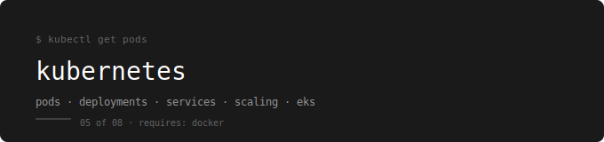

<p align="center">
  
</p>

[← devops-runbook](../../README.md)

---

A phase-by-phase learning path for Kubernetes — from local cluster to production on AWS EKS.  
Every tool and concept here transfers directly from a Minikube laptop to a 1,000-node cluster.

---

## Prerequisites

**Complete first:** [04. Docker – Containerization](../04.%20Docker%20–%20Containerization/README.md)

Kubernetes orchestrates containers. If you don't understand what a container is, how images work, and how Docker networking functions, Kubernetes will be confusing from the first YAML file.

---

## The Running Example

Throughout every phase, the webstore app serves as the practical example — a frontend, a backend API, and a database. Every manifest, every Service, every Secret is built around webstore.

| Service | Image | Port |
|---|---|---|
| webstore-frontend | nginx:1.24 | 80 |
| webstore-api | nginx:1.24 | 8080 |
| webstore-db | mariadb | 3306 |

---

## Phases

| # | Phase | Topics | Lab |
|---|---|---|---|
| 00 | [Setup](./00-setup/README.md) | Job-legal toolkit — Minikube, kubectl, K9s, Helm | [Lab 00](./k8s-labs/00-setup-lab.md) |
| 01 | [Architecture](./01-architecture/README.md) | Control Plane (API Server, etcd, Scheduler, Controller Manager), Worker Nodes | [Lab 01](./k8s-labs/01-architecture-lab.md) |
| 02 | [YAML & Pods](./02-yaml-pods/README.md) | YAML syntax, Pods, Labels and Selectors | [Lab 02](./k8s-labs/02-yaml-pods-lab.md) |
| 03 | [Deployments](./03-deployments/README.md) | ReplicaSets, Deployments, Rolling Updates, Rollbacks, Scaling | [Lab 03](./k8s-labs/03-deployments-lab.md) |
| 03.5 | [Networking](./03.5-networking/README.md) | Services (ClusterIP, NodePort, LoadBalancer), Sidecar, Namespaces | 🚧 Planned |
| 04 | [State & Config](./04-state/README.md) | Persistent Volumes, Claims, ConfigMaps, Secrets | 🚧 Planned |
| 05 | [Troubleshooting](./05-troubleshooting/README.md) | Probes, Jobs, CronJobs, DaemonSets, describe and logs | 🚧 Planned |
| 06 | [CI/CD](./06-cicd/README.md) | GitHub Actions pipeline, ArgoCD GitOps | 🚧 Planned |
| 07 | [Observability](./07-observability/README.md) | Prometheus, Grafana, alerting | 🚧 Planned |
| 08 | [Cloud & EKS](./08-cloud/README.md) | AWS EKS, Ingress Controller, HPA, eksctl | 🚧 Planned |

---

## Labs

| Lab | Topics Covered | What You Practice |
|---|---|---|
| [Lab 00](./k8s-labs/00-setup-lab.md) | Setup | Install all tools, run the cold start, open K9s in Tab 2 |
| [Lab 01](./k8s-labs/01-architecture-lab.md) | Architecture | kubectl get nodes, kubectl get pods -n kube-system, explore control plane |
| [Lab 02](./k8s-labs/02-yaml-pods-lab.md) | YAML & Pods | Write the webstore Pod in a .yaml file and apply it |
| [Lab 03](./k8s-labs/03-deployments-lab.md) | Deployments | Create a Deployment with 3 replicas, delete one Pod, watch it self-heal |
| Lab 03.5 | Networking | 🚧 Planned |
| Lab 04 | State & Config | 🚧 Planned |
| Lab 05 | Troubleshooting | 🚧 Planned |
| Lab 06 | CI/CD | 🚧 Planned |
| Lab 07 | Observability | 🚧 Planned |
| Lab 08 | Cloud & EKS | 🚧 Planned |

---

## The Non-Negotiable Daily Habit

Every session, before writing a single line of YAML:

```bash
open -a Docker && sleep 10 && docker version
minikube start
kubectl get nodes
kubectl get pods -A
```

Tab 2 → `k9s`

Every session, before closing:

```bash
minikube stop
```

---

## Tools Used Throughout

| Tool | Purpose |
|---|---|
| `kubectl` | Primary CLI for all cluster operations |
| `k9s` | Live cluster monitor — always open in Tab 2 |
| `minikube` | Local single-node cluster for all practice |
| `helm` | Package manager — installs Prometheus, ArgoCD with one command |
| `kubectx` | Switch between clusters (Minikube ↔ EKS) |
| `eksctl` | Create and manage EKS clusters on AWS |

---

## What NOT to Get Attached To

These are Minikube-only shortcuts. They do not exist in production:

| Minikube shortcut | Production replacement |
|---|---|
| `minikube dashboard` | K9s, Lens, or the AWS Console |
| `minikube service` | LoadBalancers or Ingress Controllers |
| `minikube mount` | AWS EBS or EFS |

---

## What You Can Do After This

- Explain what Kubernetes is and why Docker alone is not enough
- Read and write YAML manifests without guessing
- Deploy, scale, and roll back an application
- Expose an app to the network using the right Service type
- Store secrets and config data correctly
- Debug a broken Pod using `describe`, `logs`, and `events`
- Automate deployments using GitHub Actions and ArgoCD
- Monitor a live cluster using Prometheus and Grafana
- Build and manage a production cluster on AWS EKS

---

## What Comes Next

→ [06. AWS – Cloud Infrastructure](../06.%20AWS%20–%20Cloud%20Infrastructure/README.md)

Phase 08 of this folder (Cloud & EKS) runs on AWS. The AWS folder gives you the VPC, IAM, and EC2 foundations that EKS sits on top of.
