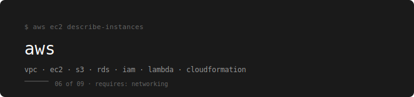

  

[← devops-runbook](../../README.md)

---

A production-focused AWS guide covering the core services every DevOps engineer uses daily — from VPC design to serverless to infrastructure automation.

---

## Prerequisites

**Complete first:** [03. Networking – Foundations](../03.%20Networking%20–%20Foundations/README.md)

Specifically, before starting AWS you should understand:
- Subnets and CIDR (file 05) — VPC design is applied subnetting
- NAT concepts (file 07) — AWS NAT Gateway is managed NAT
- Stateful vs stateless firewalls (file 09) — Security Groups and NACLs are the cloud implementation

Without these, AWS networking will feel like a configuration wizard instead of a logical system.

---

## The Running Example

Every service is introduced in the context of hosting and running the webstore application:

| Service | Image | Port |
|---|---|---|
| webstore-frontend | nginx:1.24 | 80 |
| webstore-api | nginx:1.24 | 8080 |
| webstore-db | mongo | 27017 |

---

## Topics

| # | File | What You Learn |
|---|---|---|
| 01 | [Intro to AWS](./01-intro-aws/README.md) | Cloud fundamentals, regions, AZs, the AWS global infrastructure |
| 02 | [IAM](./02-iam/README.md) | Users, roles, policies, least privilege, MFA |
| 03 | [VPC & Subnets](./03-vpc-subnet/README.md) | VPC design, subnets, routing, IGW, NAT Gateway, Security Groups, NACLs |
| 04 | [EBS](./04-ebs/README.md) | Block storage, volume types, snapshots, encryption |
| 05 | [EFS](./05-efs/README.md) | Elastic File System, shared storage, EBS vs EFS vs S3 |
| 06 | [S3](./06-s3/README.md) | Object storage, buckets, versioning, lifecycle, static hosting |
| 07 | [EC2](./07-ec2/README.md) | Virtual machines, AMIs, instance types, security groups, user data |
| 08 | [RDS](./08-rds/README.md) | Managed databases, Multi-AZ, read replicas, backups |
| 09 | [Load Balancing & Auto Scaling](./09-Load-balancing-auto-scaling/README.md) | ALB, NLB, target groups, Auto Scaling Groups, health checks |
| 10 | [CloudWatch & SNS](./10-cloudwatch-sns/README.md) | Metrics, logs, alarms, dashboards, notifications |
| 11 | [Lambda](./11-lambda/README.md) | Serverless functions, triggers, event-driven architecture |
| 12 | [Elastic Beanstalk](./12-elastic-beanstalk/README.md) | PaaS deployment, managed environments, rolling updates |
| 13 | [Route 53](./13-route53/README.md) | DNS, hosted zones, routing policies, health checks, failover |
| 14 | [CLI & CloudFormation](./14-cli-cloudformation/README.md) | AWS CLI, CloudFormation templates, infrastructure as code on AWS |

---

## Labs

| Status | Coverage |
|---|---|
| 🚧 In progress | Labs being built alongside notes |

---

## How to Use This

Read topics in order — each one builds on the previous.  
IAM before EC2 (you need to understand permissions before launching instances).  
VPC before EC2 (you need to understand networking before placing instances in it).  
EC2 before RDS (you need compute before you need managed databases).

---

## What You Can Do After This

- Design and build a production-ready multi-tier VPC from scratch
- Set up IAM correctly with least-privilege roles and no root usage
- Launch and configure EC2 instances with proper security
- Store and manage data across EBS, EFS, and S3
- Deploy a load-balanced, auto-scaling application
- Monitor infrastructure with CloudWatch and alert with SNS
- Write and deploy serverless functions with Lambda
- Manage DNS and routing with Route 53
- Automate infrastructure with the AWS CLI and CloudFormation

---

## What Comes Next

→ [07. Terraform – IaC Foundations](../07.%20Terraform%20–%20IaC%20Foundations/README.md)

CloudFormation is AWS-only. Terraform does everything CloudFormation does — and works across every cloud provider with the same workflow. After learning what AWS resources look like, Terraform lets you define and manage them as reusable, version-controlled code.
