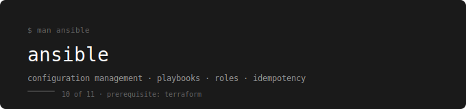

  

[← devops-runbook](../../README.md)

---

Configuration management — install software, configure servers, and manage state across many machines using simple YAML playbooks. No agent required.

---

## Prerequisites

**Complete first:** [07. Terraform – IaC Foundations](../07.%20Terraform%20–%20IaC%20Foundations/README.md)

Terraform creates infrastructure. Ansible configures it. You need to understand what infrastructure looks like before you automate its configuration. An EC2 instance you cannot manually set up is an EC2 instance you cannot automate.

---

## The Running Example

Every playbook in this folder targets the webstore stack — the same app used throughout the entire series. You will install nginx, configure it, deploy the webstore-api, and manage the full stack across multiple servers using Ansible.

---

## Topics

| # | File | What You Learn |
|---|---|---|
| 01 | [Foundations](./01-foundations/README.md) | What Ansible is, inventory, ad-hoc commands, how it connects to servers |
| 02 | [Playbooks](./02-playbooks/README.md) | Writing playbooks, tasks, handlers, variables, conditionals |
| 03 | [Roles](./03-roles/README.md) | Role structure, reusable components, organizing large playbooks |
| 04 | [Ansible + AWS](./04-ansible-aws/README.md) | Dynamic inventory, provisioning and configuring EC2 with Ansible |
| 05 | [Ansible + Docker](./05-ansible-docker/README.md) | Deploy the webstore stack using Ansible playbooks |

---

## Labs

| Lab | Topics Covered | What You Practice |
|---|---|---|
| Lab 01 | Foundations | Install Ansible, write inventory, run ad-hoc commands against a server |
| Lab 02 | Playbooks | Write a playbook that installs and configures nginx for webstore-frontend |
| Lab 03 | Roles | Refactor the playbook into a reusable role |
| Lab 04 | Ansible + AWS | Use dynamic inventory to configure EC2 instances automatically |
| Lab 05 | Ansible + Docker | Write a playbook that deploys the full webstore Docker stack |

---

## How to Use This

Read topics in order. Each one builds on the previous.  
After each topic do the lab before moving on.  
The checklist at the end of every lab is not optional.

---

## The Key Concept — Idempotency

Running the same Ansible playbook twice produces the same result. If nginx is already installed and configured correctly, Ansible does nothing. If something drifted, Ansible fixes it. This is what makes configuration management safe to run repeatedly.

---

## What You Can Do After This

- Write Ansible playbooks to install and configure any software on any server
- Structure playbooks into reusable roles for multiple environments
- Use dynamic inventory to target AWS EC2 instances automatically
- Deploy and manage Docker stacks across multiple hosts
- Combine Terraform (infrastructure) with Ansible (configuration) in a real workflow

---

## What Comes Next

→ [09. Bash – Shell Scripting Essentials](../09.%20Bash%20–%20Shell%20Scripting%20Essentials/README.md)

Ansible handles server configuration. Bash handles everything in between — deployment scripts, cron jobs, log processing, and the glue that connects tools together in CI/CD pipelines.
