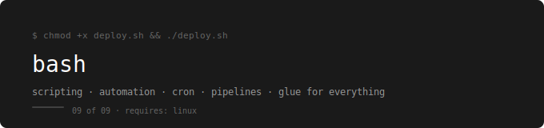

<p align="center">
  
</p>

[← devops-runbook](../../README.md)

---

Shell scripting, automation, and the glue that connects every DevOps tool together — cron jobs, deployment scripts, log processing, and CI/CD pipelines.

---

## Prerequisites

**Complete first:** [08. Ansible – Configuration Management](../08.%20Ansible%20–%20Configuration%20Management/README.md)

Bash scripting is Linux commands put into files and made repeatable. You need to be comfortable with the Linux command line — file operations, process management, and text processing — before scripting makes sense.

Bash becomes most powerful after you have worked with every other tool in this series. It ties everything together — automating Docker builds, running Terraform, processing AWS CLI output, triggering Ansible playbooks, and building deployment pipelines.

---

## The Running Example

Every script in this folder operates on the webstore project — the same app used throughout the entire series. Deployment scripts, backup automation, log analysis, and health checks all target the webstore stack.

---

## Phases

| Phase | Topics | Lab |
|---|---|---|
| 1 — Foundations | [01 Bash Foundations](./01-bash-foundations/README.md) | Lab 01 |
| 2 — Text Processing | [02 Text Processing](./02-text-processing/README.md) | Lab 02 |
| 3 — Error Handling | [03 Script Structure & Error Handling](./03-script-structure/README.md) | Lab 03 |
| 4 — Automation | [04 Automation & Cron](./04-automation-cron/README.md) | Lab 04 |
| 5 — DevOps Patterns | [05 DevOps Scripting Patterns](./05-devops-patterns/README.md) | Lab 05 |

---

## Labs

| Lab | Topics Covered | What You Practice |
|---|---|---|
| Lab 01 | Foundations | Variables, input, conditionals, loops, functions — write from scratch |
| Lab 02 | Text Processing | grep, sed, awk in scripts — parse webstore log output |
| Lab 03 | Error Handling | Exit codes, set -e, trap, logging — make scripts fail loudly |
| Lab 04 | Automation & Cron | crontab, scheduled backup of webstore-db, log rotation |
| Lab 05 | DevOps Patterns | Deployment script, health check, Docker automation, CI/CD hooks |

---

## How to Use This

Read phases in order. Each one builds on the previous.  
After each phase do the lab before moving on.  
The checklist at the end of every lab is not optional.

---

## What You Can Do After This

- Write deployment scripts that are safe to run in production
- Automate repetitive tasks with cron and scheduled jobs
- Parse and process log output from any tool
- Build health check scripts for Docker and Kubernetes workloads
- Write CI/CD pipeline scripts that are readable and debuggable
- Handle errors correctly so scripts fail loudly, not silently

---

## This Folder Ties Everything Together

Bash is the last piece. Every tool in this series has a command-line interface. Bash is what connects them:

```
Linux commands  → Bash scripts
Git operations  → Automated in CI/CD hooks
Docker builds   → Scripted in deployment pipelines
kubectl apply   → Wrapped in deployment scripts
AWS CLI calls   → Automated in maintenance scripts
Terraform runs  → Orchestrated in pipeline scripts
Ansible plays   → Triggered from deployment scripts
```

When you can write a Bash script that builds a Docker image, pushes it to a registry, applies a Kubernetes deployment, runs an Ansible playbook, and sends a Slack notification if anything fails — you are working like a DevOps engineer.
